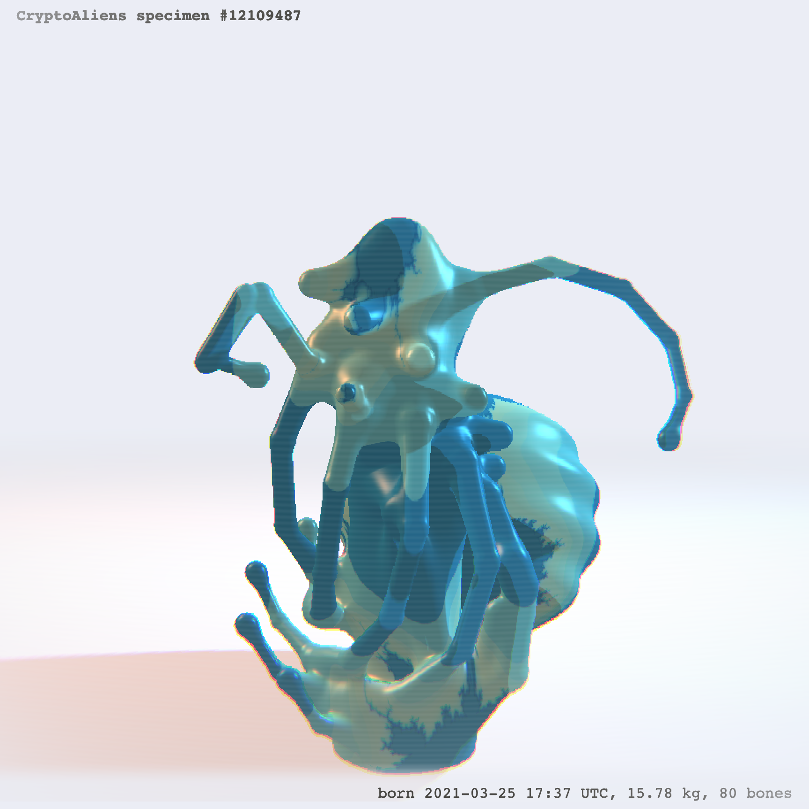
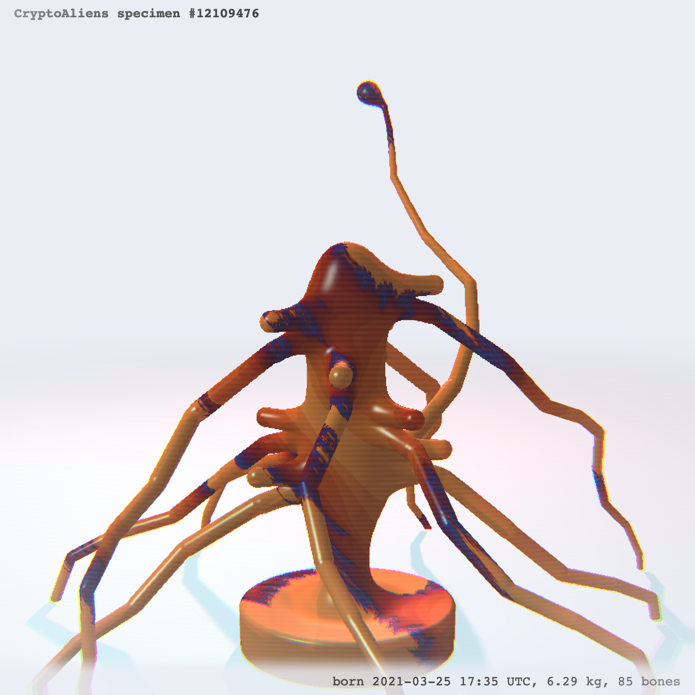

# CryptoAliens: Genesis


## What are CryptoAliens?

CryptoAliens are digital creatures generated from Ethereum blockchain blocks. They can be minted on [ethblock.art](https://ethblock.art/styles) by anyone, which establishes a limited set of CryptoAliens species. Each block produced on Ethereum have unique elements that can be visualized in creative ways.


> **CryptoAliens are born and nourished from transactions, transactions are bones, ETH is flesh,... and many other aspects that this article will explain!**


### So I decide which ones are the CryptoAliens?

**Yes! As a NFT minter, you are the creator and you contribute at establishing the first 'Genesis' series of CryptoAliens.** You decide which creature deserve to live. You are the curator and it is your responsible to do a lot of research and find the most adorable (or the creepiest?) creature!


### How many CryptoAliens are there?

Every single CryptoAliens species is unique and there are currently 12 millions because that's as many blocks there are today (April 2021). Every 15 seconds, a new block is minted on Ethereum blockchain (with usually hundreds of transactions in it) making a new CryptoAliens possibility.
The block is the DNA, but the creature only starts existing when minted!

**TLDR. CryptoAliens only comes to life when someone mint it as an NFT on the [ethblock.art](https://ethblock.art) contract.** They can then be sold and traded on [opensea.io](https://opensea.io). There is **a limited amount of CryptoAliens possible to mint** so be wise at your choice. The current supply is set to 100!


### What determines how a CryptoAliens specimen looks like?

There are many information contains in Ethereum blocks that will get used to determine the general shape and gives its rarity.

### Timestamp



When the block happened during UTC night, the visual will be in dark mode.

### Heavy transactions amount


When a block contains a lot of transactions it will impact its general weight. It will be highlighted by this very heavy blobs shapes. That said, the weight can be more or less dense based on amount of bones and also unique for each CryptoAliens specimen.

### Heavy Ethereum transfers


As said in the introduction, "ETH is flesh". Even tho most of the time it will impact the general weight of the creature, when a block contains an expectionally high transfer of Ethereum value, it will be highlighted by a big "head" on the creature. ("head" in doublequote because none of our scientist really figured what is this)

### Very few ETH amounts transferred


On the contrary, when a block contains almost no ETH transfers, the arms will be very thin. Clearly ETH traders didn't nourish enough this poor creature.

### A lot of gas used (vs ETH value transfer)


It often appears in combination with the previous criteria, if the ratio `total gas / total eth transfers` is high, meaning that a lot of the ETH is into gas, there will be some blobs at the end of the arms.

#### Rare features

There are a lot of special cases are rare conditions that can happen. I will not disclose and I will let you discover. Some are really rare and some will be discovered in the future (even the author of blockstyle won't be aware of all cases!).

### Block hash

Finally, the block hash gives variety in the results. It's necessary in order to have truly unique 12 millions species. But it's only complementary to the various other criteria. There are many features that are getting impacted by it, including the skin texturing (see _Mandelglitch BlockStyle_ section).




### What controls does the creator have?

At creation time, the minter also have the ability to move a bit the specimen:

- `mod1` is a simple rotation around it.
- `mod2` is a simple climbing and zooming.
- `mod3` will flex a bit the shape to make it torn & twist a bit.
- `mod4` have an impact on the color palette scaling.

**On top of this, mods have the ability to transform the skin texturing** which is actually based on [Mandelglitch BlockStyle](https://ethblock.art/create/17)! That means the rarity elements of Mandelglitch are shared in this new BlockStyle.

### mmh, Mandelglitch BlockStyle?

<a href="https://ethblock.art/create/17"></a>

[Mandelglitch BlockStyle](https://ethblock.art/create/17) is another BlockStyle on [ethblock.art](https://ethblock.art/create/17). It's derived from Mandelbrot fractal.

The visibility of Mandelglitch on the skin has been intentionally contained, but sometimes it is more visible. Here are two examples:


## How is it implemented technically?

First of all, I would like to point out the [source code is available here on Github](https://github.com/gre/shaderday.com/tree/master/blockarts/CryptoAliens).

It is implemented with [`gl-react`](https://github.com/gre/gl-react) which is convenient to write and compose [_GLSL Fragment Shaders_](https://www.khronos.org/opengl/wiki/Fragment_Shader).

> There are actually 3 shaders and a Canvas 2D texture at stake, here is the big picture of the pipeline:
> **TODO**

It also uses `mersenne-twister` library, a [PRNG](https://en.wikipedia.org/wiki/Pseudorandom_number_generator) used to get a wide and deterministic variety of shapes, initialized with the block hash. That said, as pointed in the previous section, the main features of the shape are determined by Ethereum block information itself (number of transactions, timestamp, transfers, gas used,...).

I kickstarted this whole idea on [Twitch](https://twitch.tv/greweb). A recording is [available on Youtube](https://www.youtube.com/watch?v=WUzOlLq0IAo). Apart from the many glitches this 3 hours session had remained to be solved, the main part of this was implemented that night. Indeed I had to work countlessly on polishing the shaders, lighting and work on post-processing.

The technique implemented on the main shader is [raymarching distance functions](https://www.iquilezles.org/www/articles/raymarchingdf/raymarchingdf.htm). The shapes at stake are mostly segments that are merged with a smooth union. There are many loops involved which made it challenging to optimize.
There may be issues on some mobile phone even tho it works on mine thanks to a "pixelated" version. (downscaling the pixels helped)

### How is Mandelglitch used?

As said, [Mandelglitch BlockStyle](https://ethblock.art/create/17) is re-used in this CryptoAliens BlockStyle. This really is the power of gl-react: it makes such composability really easy to do, the same way you can compose React components.

You can see in the [Youtube recording](https://www.youtube.com/watch?v=WUzOlLq0IAo) the way I have implemented it initially: it is just a simple import of Mandelglitch.js (literally the BlockStyle as-is) that I can just send as a uniform sampler2D.

```js
<Node
  shader={sceneShaders.scene}
  uniforms={{
    t: <Mandelglitch block={block} mod1={mod1} mod2={mod2} mod3={mod3} />,
  ...
```

after that, it was simpler to embed Mandelglitch in the BlockStyle.

The way Mandelglitch texturing is used however is that I will only use the "red" component and remap it to CryptoAliens' own palette, in order to have a better control of the coloring.

## ...and, What's next?

Who knows what's next! As everything is available on the blockchain, what you mint is saved immutably and forever. Me or other artists could fork the code to make animated version of the CryptoAliens that were chosen (as this code is open source). Also we can imagine doing crossover between species or doing "evolution" of these species over time. Everything is possible!

---

My name is Gaëtan Renaudeau, and I'm a noise explorer. **feel free to ping me on Twitter [@greweb](https://twitter.com/greweb)**
