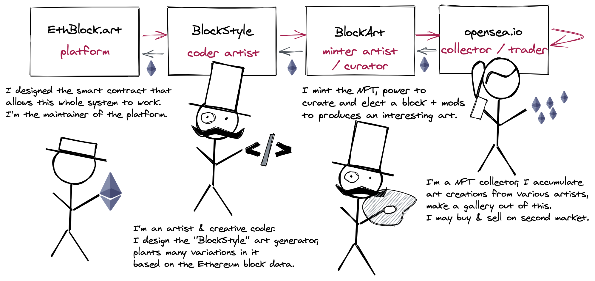

# CryptoAliens: Genesis, a technical look

> See also [CryptoAliens: Genesis](README.md) main article.

This article explains how [CryptoAliens: Genesis (ethblock.art)](README.md) works in technical depth.


First of all, I would like to point out the [source code is available here on Github](https://github.com/gre/shaderday.com/tree/master/blockarts/CryptoAliens).

This whole idea was kicked off on [Twitch](https://twitch.tv/greweb). A recording is [available on Youtube](https://www.youtube.com/watch?v=WUzOlLq0IAo). Apart from the many glitches this 3 hours session had remained to be solved, the main part of this was implemented that night. Indeed I had to work countlessly on polishing the shaders, lighting and post-processing. I also spent a lot of time using the block data in a meaningful way because it's what [EthBlock.art](https://ethblock.art) really is about.

## EthBlock.art revolutionary idea

Before going further into the technical details of CryptoAliens, I would like to point out how revolutionary this EthBlock.art idea is.

The project aims to create a virtuous ecosystem of "deterministic art", code visualization of Ethereum blocks. Everything is data: from the ethereum block of transactions, to the code that visualize it, and to the NFTs minted/traded using Ethereum transactions (that themselves are into Ethereum blocks).

**This is a virtuous ecosystem, similar to [Supply Chain Transformation concepts](https://en.wikipedia.org/wiki/Value_chain): each actor in this ecosystem add value and get retributed for it, as I tried to explain in this schema:**



`CryptoAliens: Genesis` is one possible BlockStyle that I've designed, as a creative coder. It tries to visualize what happened in the Ethereum Block and will take mods into account to try to be as good as possible to deliver interesting possibilities to BlockArt minters.

## Ok, so how is it implemented technically?

Indeed WebGL.

More precisely, it is implemented with [`gl-react`](https://github.com/gre/gl-react) which is convenient to write and compose [_GLSL Fragment Shaders_](https://www.khronos.org/opengl/wiki/Fragment_Shader).

**here is the big picture of the pipeline:**


There are 2 main shaders: Mandelglitch (for skin texturing) and Scene (the main raymarching shader). Each of them take a bunch of parameters. `mod1..4` are values from the creator. The rest are inferred from the Block information, they are split into multiple parameters for convenience.

The parameters `s1..9` are coming directly from `mersenne-twister` library, a [PRNG](https://en.wikipedia.org/wiki/Pseudorandom_number_generator) used to get a wide and deterministic variety of shapes, initialized with the block hash. That said, as pointed in the previous section, the main features of the shape are determined by Ethereum block information itself (number of transactions, timestamp, transfers, gas used,...).

On top of these, some other parameters are controling key elements they come from more block information (heavy, head, bonesK, arms info,...).

The technique implemented on the main Scene shader is [raymarching distance functions](https://www.iquilezles.org/www/articles/raymarchingdf/raymarchingdf.htm). The shapes at stake are mostly segments that are merged with a smooth union. There are many loops involved which made it challenging to optimize.
There may be issues on some mobile phone even tho it works on mine thanks to a "pixelated" version. (downscaling the pixels helped)

Because of an heavy usage of this technique, the main scene was really challenging to optimize, it actually runs something like 5 FPS. My choice was to not animate it directly (you can see on the rendering graph that actually the buffer don't need to refresh, except when a "mod" is changed). However, thanks to intermediary framebuffers we can do 60 FPS animation at the postprocessing level. This is what the final user will get as the mods are static.

### Canvas 2D to draw texts

A Canvas 2D element is used to draw the text that will appear on top of everything.

```js
/// canvas used to draw in postprocessing ///
function FrameText({ blockNumber, dateText, width, height, kg, bones }) {
  const onCanvasRef = (canvas) => {
    if (!canvas) return;
    const ctx = canvas.getContext("2d");
    const w = ctx.canvas.width;
    const h = ctx.canvas.height;
    const pad = Math.round(w * 0.01);
    const padX = Math.round(w * 0.02);
    const fontS = Math.floor(0.19 * w) / 10;
    const fontSize = `${fontS}px`;
    ctx.save();
    ctx.fillStyle = "#000";
    ctx.fillRect(0, 0, w, h);
    ctx.font = "bold " + fontSize + " monospace";
    ctx.textBaseline = "top";
    ctx.fillStyle = "#fff";
    ctx.fillText(`CryptoAliens specimen #${blockNumber}`, padX, pad);
    ctx.textBaseline = "bottom";
    ctx.textAlign = "right";
    ctx.font = fontSize + " monospace";
    ctx.fillText(
      `born ${dateText}, ${kg} kg, ${bones} bones`,
      w - padX,
      h - pad
    );
    ctx.restore();
  };
  return (
    <canvas
      ref={onCanvasRef}
      width={String(width * 2)}
      height={String(height * 2)}
    />
  );
}
const FrameTextCached = React.memo(FrameText);
```

### How is Mandelglitch used?

As said, [Mandelglitch BlockStyle](https://ethblock.art/create/17) is re-used in this CryptoAliens BlockStyle. This really is the power of gl-react: it makes such composability really easy to do, the same way you can compose React components.

You can see in the [Youtube recording](https://www.youtube.com/watch?v=WUzOlLq0IAo) the way I have implemented it initially: it is just a simple import of Mandelglitch.js (literally the BlockStyle as-is) that I can just send as a uniform sampler2D.

```
<Node
  shader={sceneShaders.scene}
  uniforms={{
    t: <Mandelglitch block={block} mod1={mod1} mod2={mod2} mod3={mod3} />,
  ...
```

after that, it was simpler to embed Mandelglitch in the BlockStyle.

The way Mandelglitch texturing is used however is that I will only use the "red" component and remap it to CryptoAliens' own palette, in order to have a better control of the coloring.

### Code organisation

React and Gl-React allows to organize the code relatively easily. First of all each pass in the rendering scene is a component, then shaders are organized in the `Shaders.create` usage. I've tried to collocate them (still in same one big file to simplify the upload to EthBlock.art).

I find it pretty convenient to externalize piece of the logic into "hooks" function. Example:

```js
const CustomStyle = (props) => {
  // prettier-ignore
  const { block, attributesRef, mod1, mod2, mod3, mod4, highQuality, width, height } = props;
  // prettier-ignore
  const { kg, bones, theme, background, s1, s2, s3, s4, s5, s6, s7, s8, heavy, head, bonesK, armsLen, armsSpread, armsCenter, armsEndW, dateText, blockNumber } =
    useBlockDerivedData(block, mod1, mod2, mod3, mod4);

  useAttributesSync(attributesRef, kg, bones, theme);

  return (
    <LiveTV
      text={
        <FrameTextCached ... />
      }
      ...
    >
      <NearestCopy width={w} height={h}>
        <Scene
          t={<MandelglitchCached ... />}
          ...
        />
      </NearestCopy>
    </LiveTV>
  );
};
```

`useBlockDerivedData` internally uses `useMemo` in order to cache the computation of block data interpretation.

In order to make **only** one part of the tree to actively re-render, i've used a local `useTime` that would re-render only that part (the LiveTV final shader). It's implementation is trivial:

```js
function useTime() {
  const [time, setTime] = useState(0);
  useEffect(() => {
    let startT;
    let h;
    function loop(t) {
      h = requestAnimationFrame(loop);
      if (!startT) startT = t;
      setTime((t - startT) / 1000);
    }
    h = requestAnimationFrame(loop);
    return () => cancelAnimationFrame(h);
  }, []);
  return time;
}
```

## Arms joints rotation, GLSL random and determinism

Ok, this is a hard topic. But it's extremely important that every BlockArt reliably produce the same result with the same block data, regardless of the computer used.

That last "regardless of computer used" part has challenged me at the last minute! JavaScript doesn't have this problem because it's stable between implementations (computers, engines). However, **this is not the case with OpenGL / GLSL**: every computer, every hardware (GPU) or possibly the "backend" implementation for WebGL ([ANGLE](https://github.com/google/angle) have different backends) can differ when it comes to float precision and primitive results.

In my shader, I was using the classical `random` function that is documented at https://thebookofshaders.com/10/

```cpp
float random (vec2 st) {
  return fract(sin(dot(st.xy, vec2(12.9898,78.233))) * 43758.5453123);
}
```

It works very well when you need a nice 2D distributed noise for basic effects **but it is very bad if you strongly rely on a stable & consistent noise to generate different shapes**.

Empirically, I can observe that `sin()` yields different results on different computers.

This was impacting me badly because I was able to see very various shapes:


What I need to varies a bit here is just the angle at each joint of the arms. This is very important for the uniqueness of the creature. The problem is that if each value changes a tiny bit, the whole thing diverge VERY QUICKLY, as the rotation angle will accumulate.

Worse than that, I had a bad pattern to accumulate randomness like this:

```cpp
float ss1 = s1;
for (int i = 0; i < armsLen; i++) {
  ss1 = random(ss1);
  ...
}
```

Actually I don't need that, first of all it's probably not good for performance, secondly I can just afford taking the fractional part of a simple polynomial:

```cpp
float arm (inout vec3 p, float index, float w, float h) {
  float s = sdSegment(p, h, w);
  float base1 = 305.53 * s1 + 77.21 * index;
  float base2 = 403.53 * s2 + 69.71 * index;
  for (int i = 0; i < armsLen; i++) {
    float fi = float(i);
    float ss1 = fract(base1 + 9.412 * fi);
    float ss2 = fract(base2 + 8.823 * fi);
    pR(p.xy, 8. * s4 * (ss2-.5));
    pR(p.xz, 6. * s5 * (ss1-.5));
    s = fOpUnionSoft(bonesK, s, sdSegment(p, h, w));
    h *= .9;
    w *= .9;
    p.y -= 1.2 * h;
  }
  s = fOpUnionSoft(bonesK + 0.2 * s5, s, length(p) - armsEndW);
  return s;
}
```

Note that here it's very arbitrary numbers, the point is to obtain variety and unpredictability in the results. `fract` is a very simple operation (take the fractional part of the number). Indeed i'm still prone to approximation, but the risk is limited by the fact i don't go too high in values here. Worse case scenario is it varies a bit the rotation but it should be so tiny that it won't be visible.

As said before and as seen in this code, the number will be used to do rotations (that `pR` is transforming `p` with some rotations). I use `s4` and `s5` values to give the magnitude of rotations.

**Let's look at a few cases:**

If both s4 and s5 are very near 0.0, it will be straight arms (it's a rare case therefore).


If one of the s4 or s5 are 0.0, it will be only happening on one "plan", or slightly diverging spirals, which I assume also to be rare cases:


Otherwise, most of the times, it will be relatively random:


## going 128px. Last minute decision, hard tradeoff

Due to concerns on the "deterministic rendering" from Ethblock.art folks, I had to make a choice regarding the fact it was too slow on mobile... I've decided to switch to 128x128 rendering for ALL platforms so it's consistent.

All the images on that article were done on 1024x1024 which is slow on computer and not even working on my mobile phone. (OnePlus)

It's hard to have efficient raymarching today when you have many items.

**Ultimately, I like how it finally looks, there were some minimalism / cell shaded styles,.. now it embraces Pixel Art even more!**


It's also always possible to make higher quality version of these rendering and I'm excited to experiment more of these in future.

---

My name is Gaëtan Renaudeau, and I'm a noise explorer. **feel free to ping me on Twitter [@greweb](https://twitter.com/greweb)**
