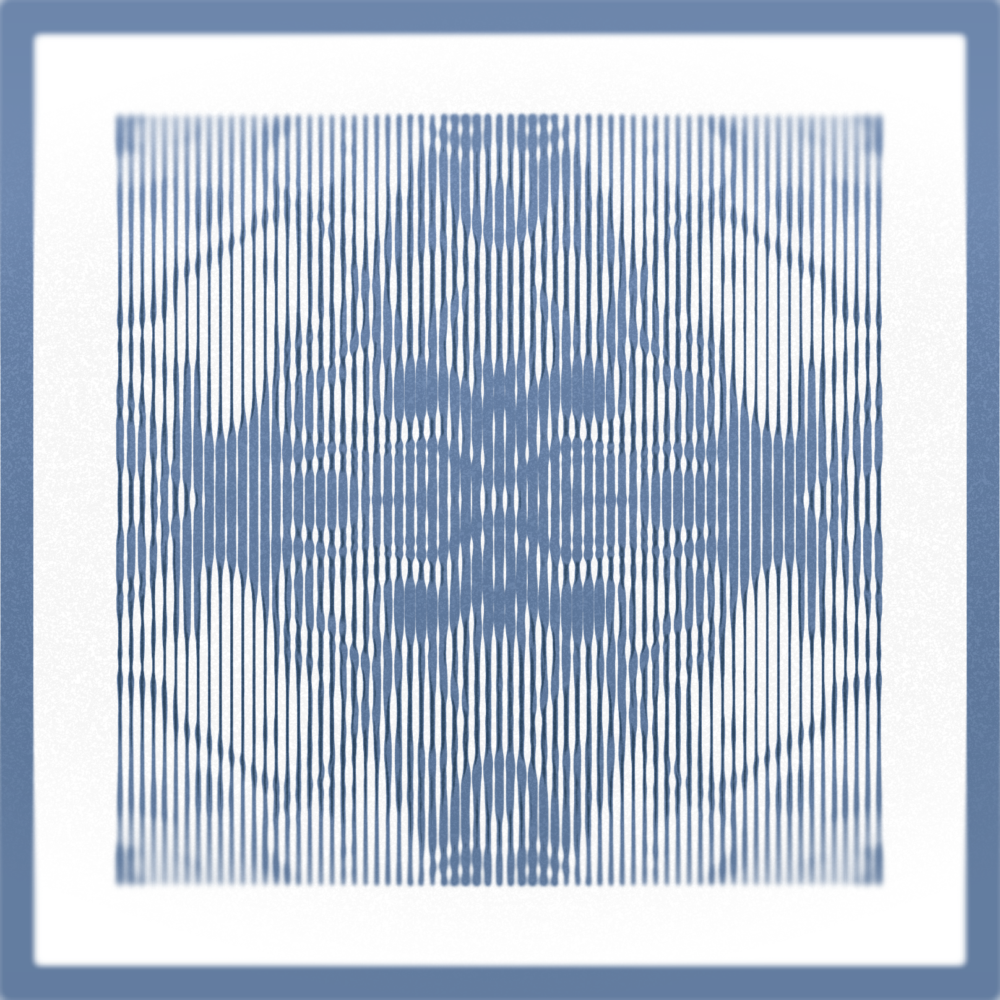
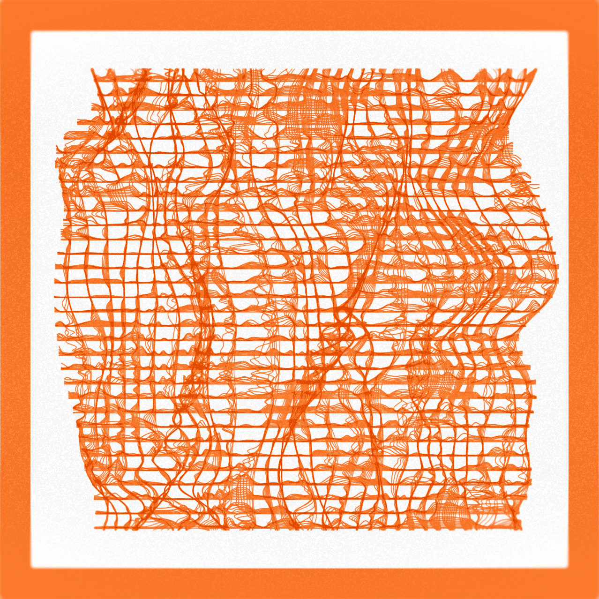
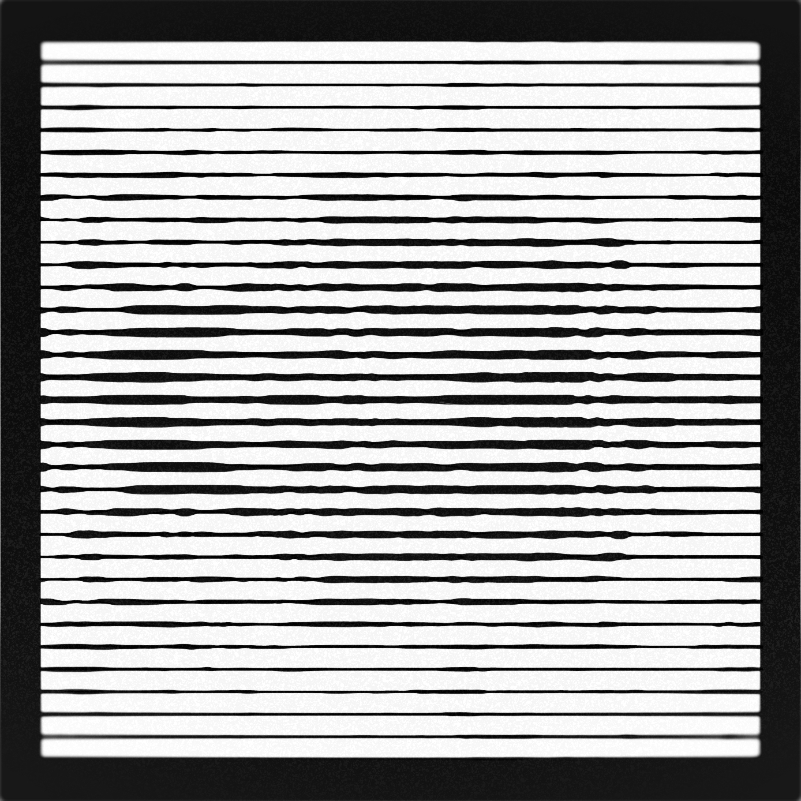

## "Pattern 03" by greweb



Pattern 03 is a tribute to fountain pen plotting, generating strokes lines to yield unique patterns. It recreates the condition of ink on paper in a digital art form. The second market will be interesting as these are also physically plottable. The NFT allows to download a SVG file: recipe for a physical artist to perform the art physically, with their own tools.

MOD1: allows you to pick your color. which recreates the conditions of some inks. Black is very powerful but also other inks are very vivid. It's given to you as a mod control to pick one.

MOD2: is controlling two factors, the border width (0.5 to 1.0) and the intensity of the noise (cycles twice).

MOD3: is a general padding control and also tweaks border placement and sometimes lines distance.

MOD4: control the alignment of waves and the amplitude of the "displacement" effect.

MOD5: controls the resolution of each line. (beware high values slows down other mods)

MOD6: adds a variable blur effect.


As all BlockStyles, this script visualize Ethereum's block data: number of lines is driven by transactions count in the block, The shape is driven by $value of ERC20 transfers vs ETH. When high value is in ETH, a spiral is used, vertical lines means more $ in ETH, horizontal otherwise, cross hatch when there are exceptional ERC20 transfers. (evaluated with Aug 2021 static prices)

There are many rare features to discover and intentionally not all documented: ultimately, don't hunt for the rarity that are "designed by the author", search for the organic rarity & enjoy patterns and unexpected shapes.

**options**

```
{"mod1":0.0001,"mod2":0.0001,"mod3":0.3,"mod4":0.5,"mod5":0.5,"mod6":0.3}
```

---

- This BlockStyle is a melting pot of technologies: Rust, WASM, SVG and WebGL!

---


