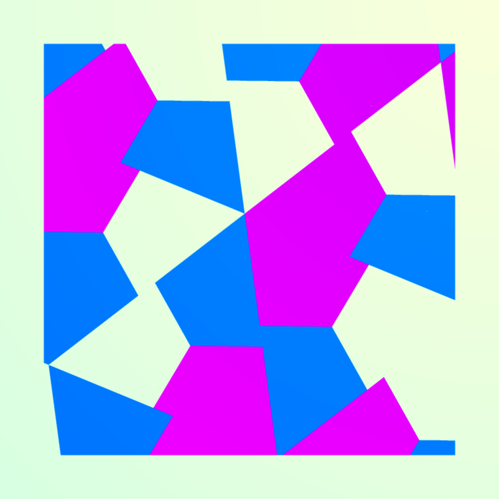
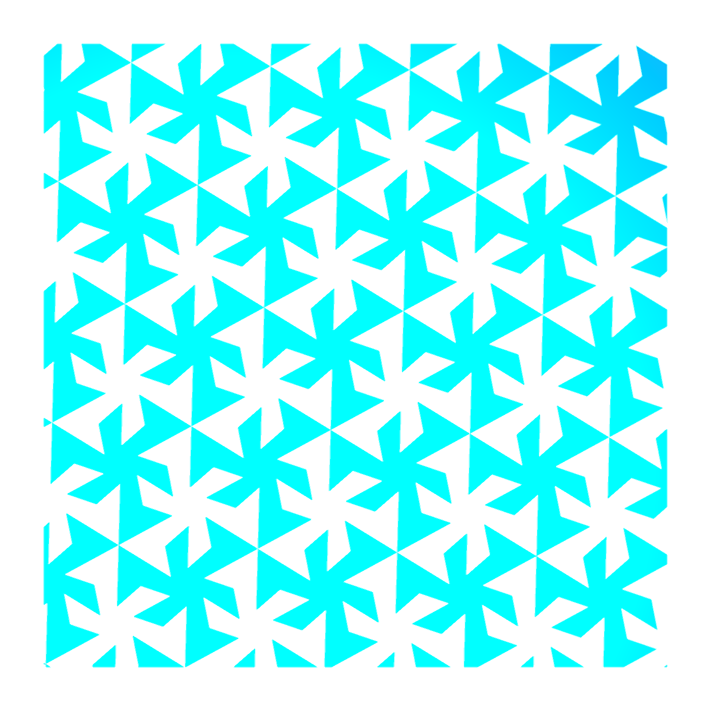
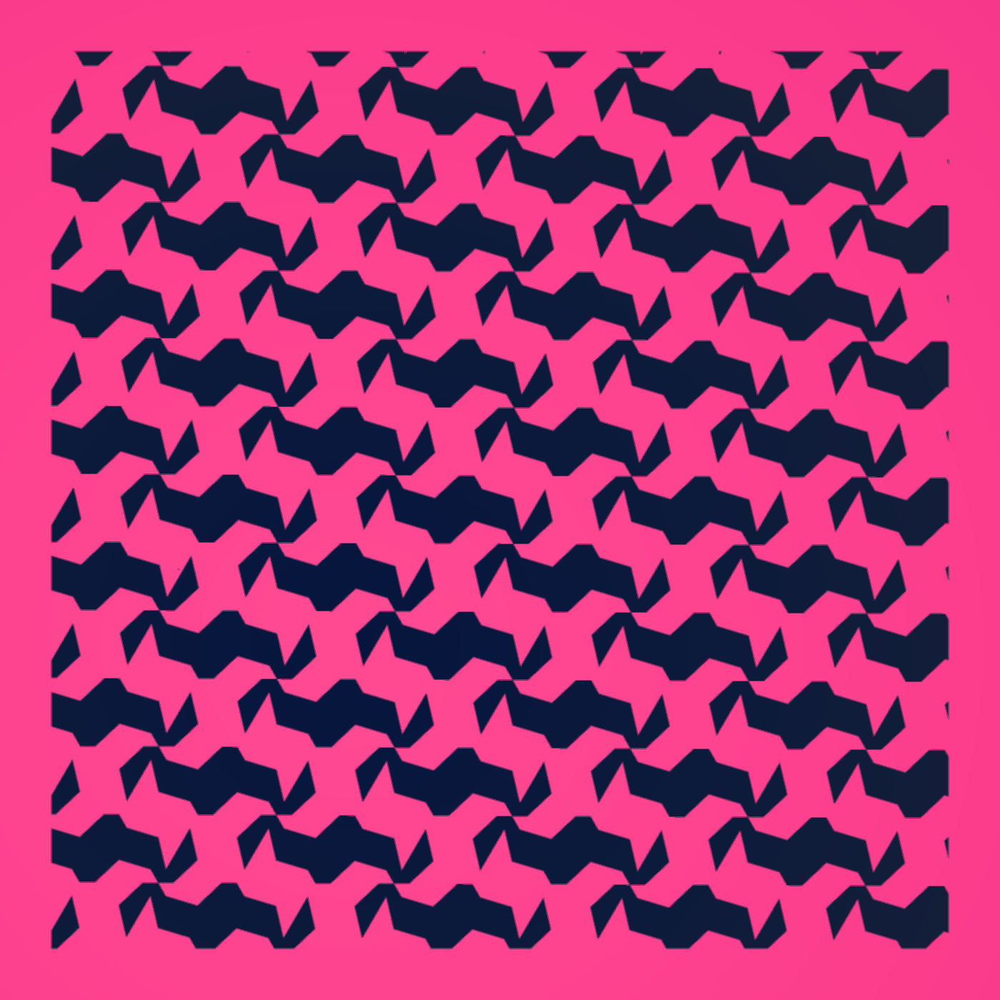
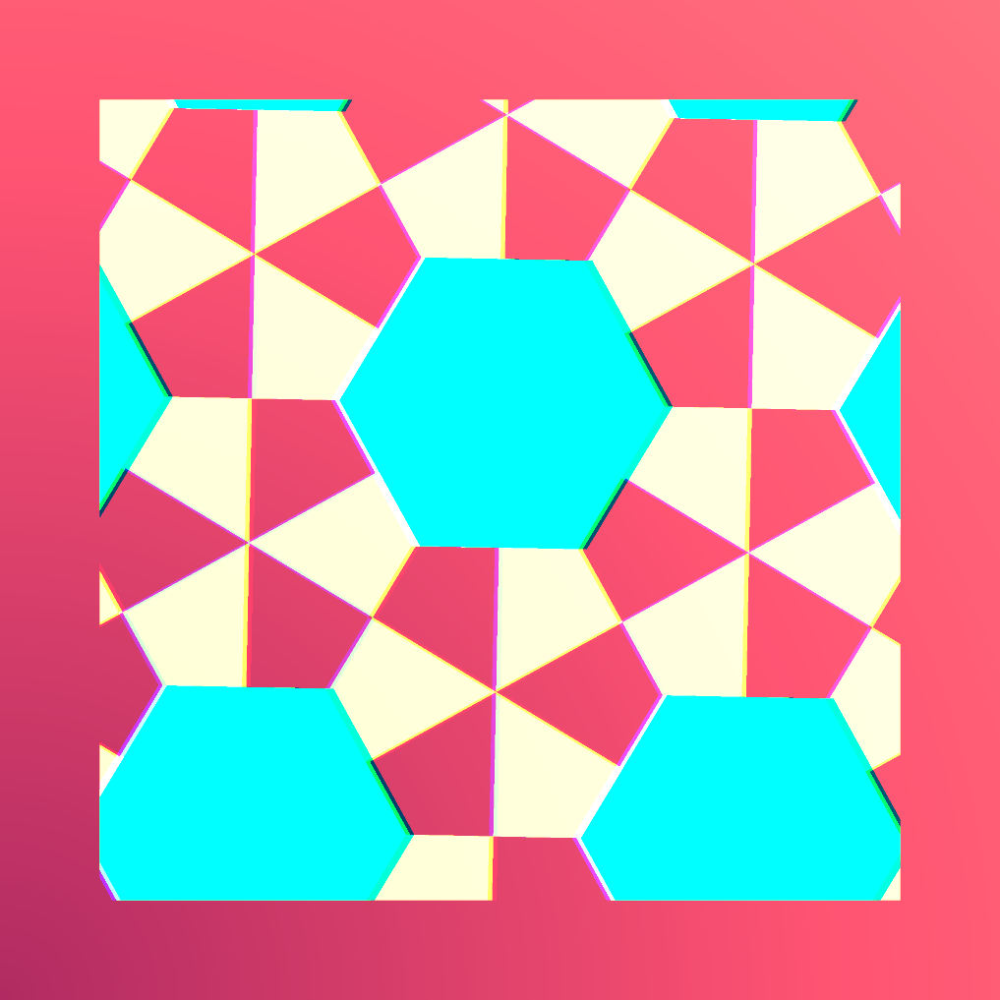
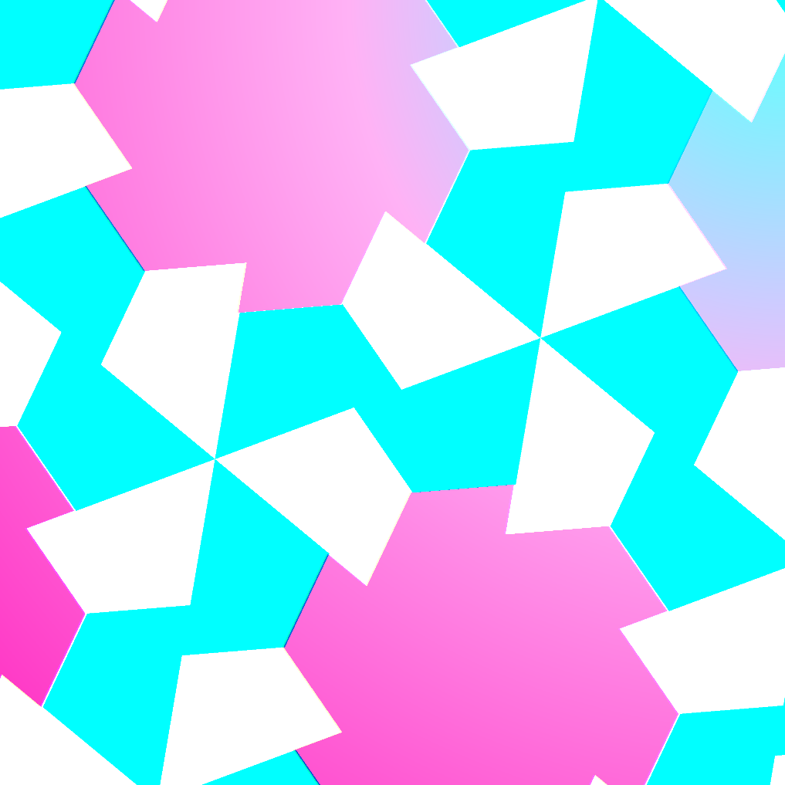
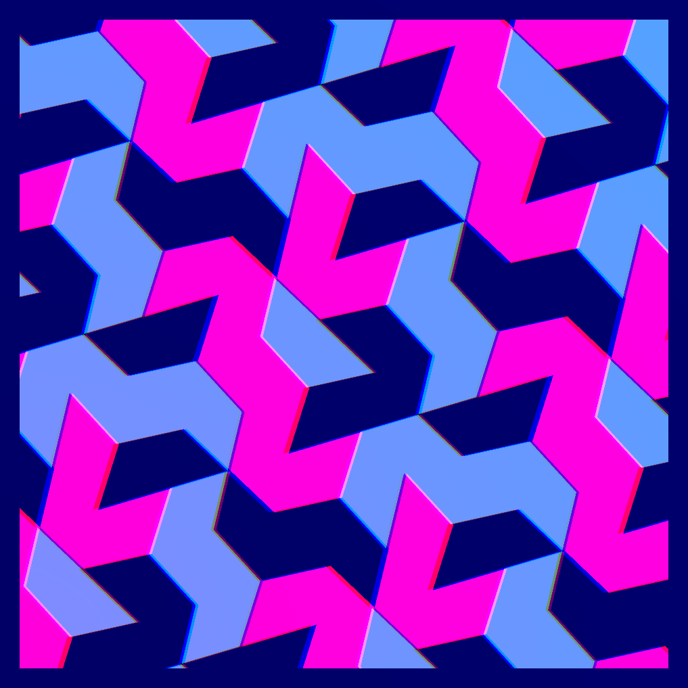
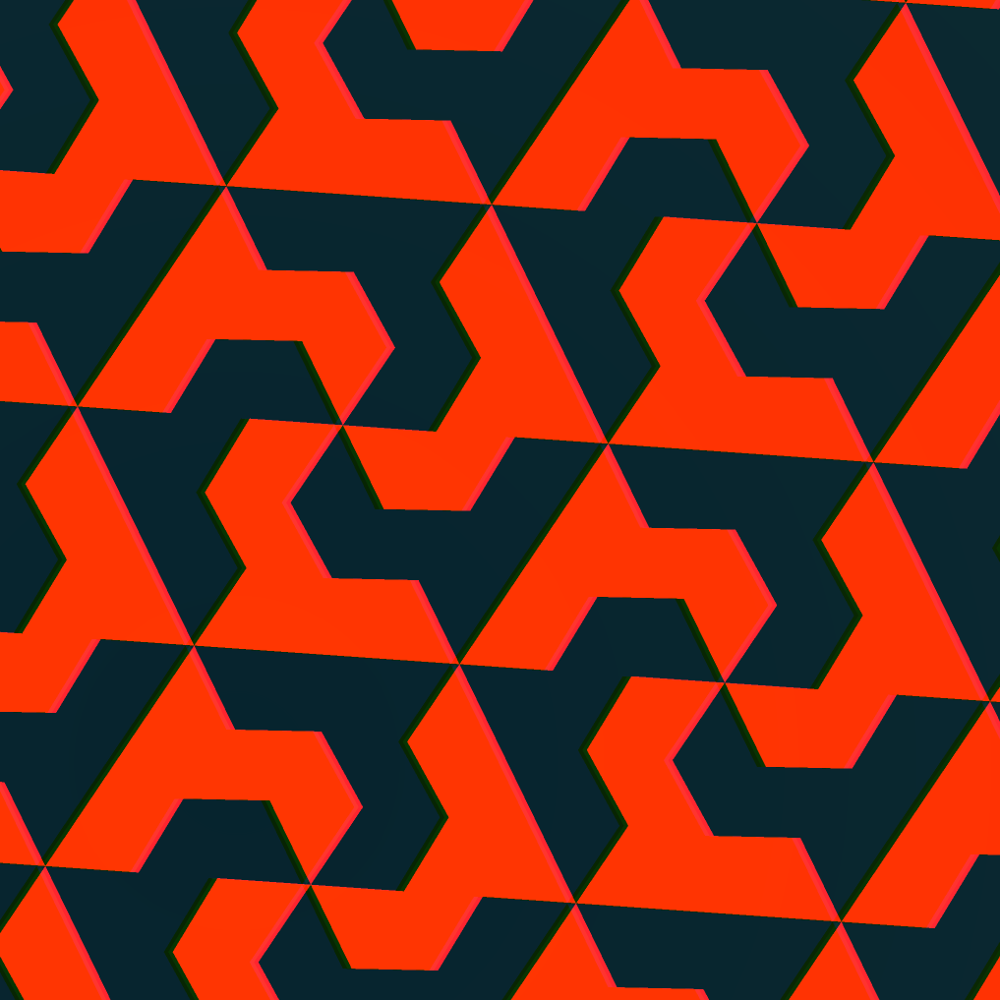
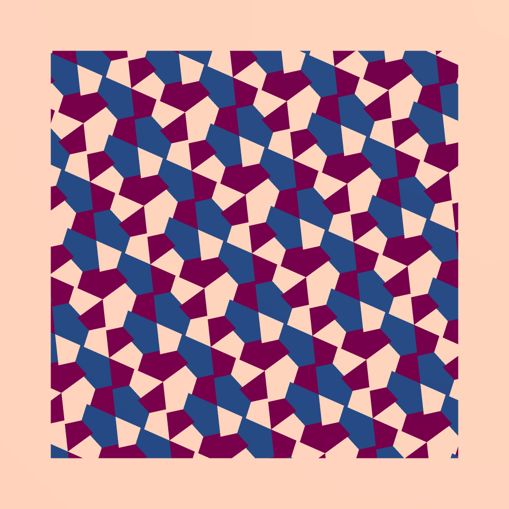
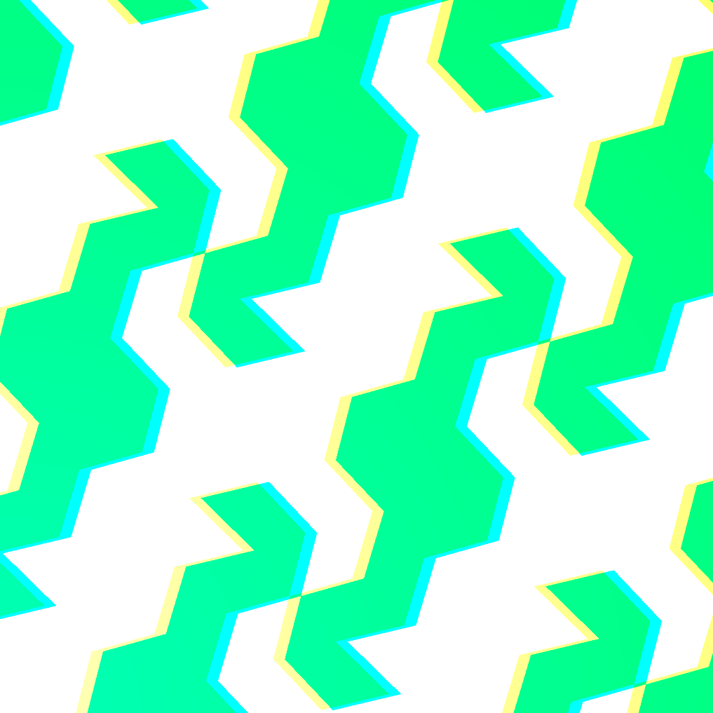
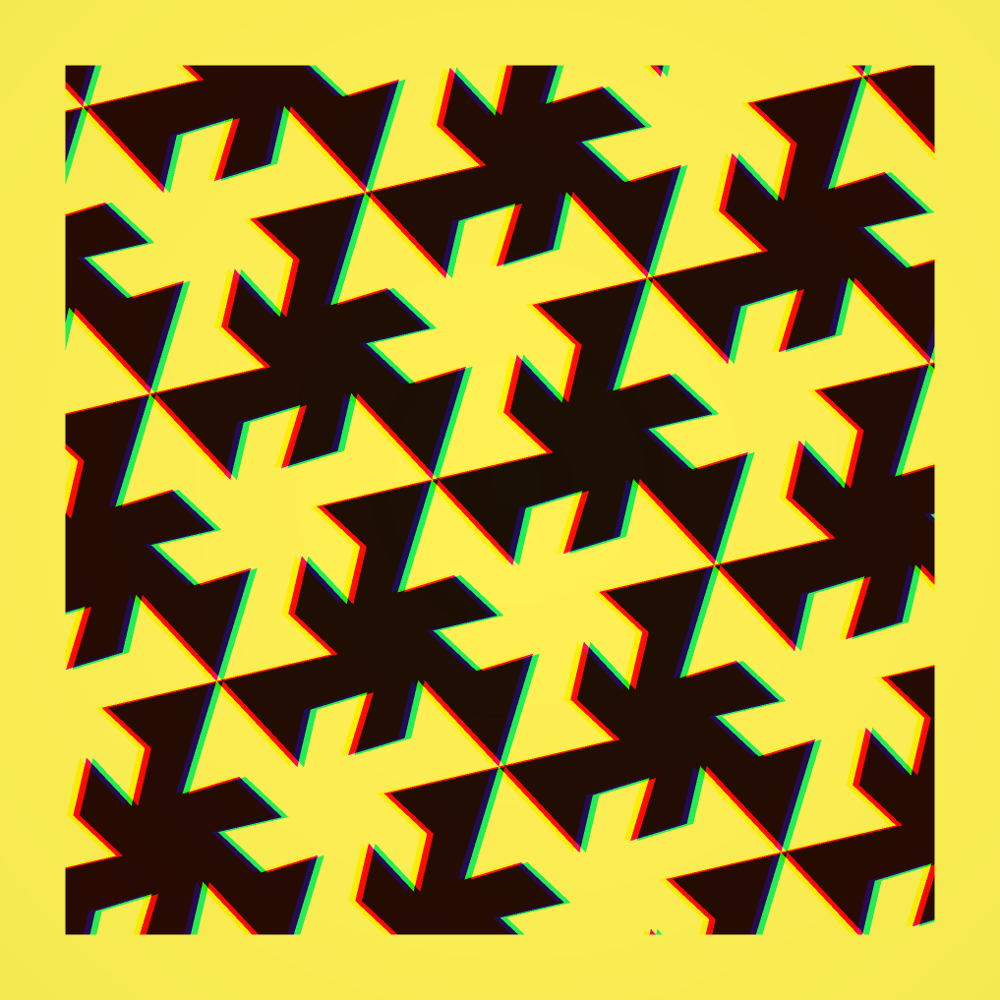

## Pattern 02 – designed for ethblock.art

[source code](index.js)

> Welcome to the realm of hexagonal & triangular patterns. Have fun exploring the great variety of patterns and color palettes. The block hash drives the main shape, creators are able to finetune things. Many colors at same time is uncommon, Grayscale is rare, and as in Pattern 01, good luck to mint a GOLD pattern!

                                  
