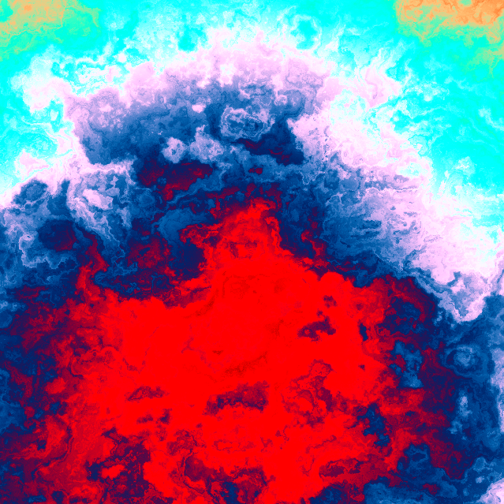
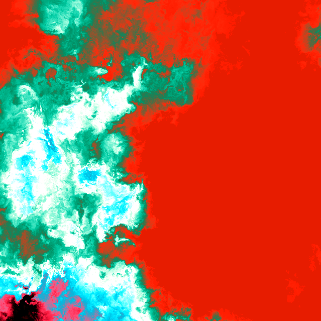
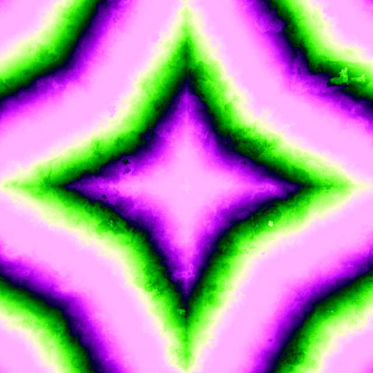
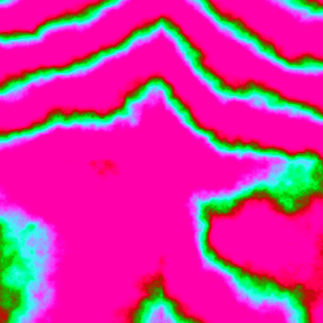
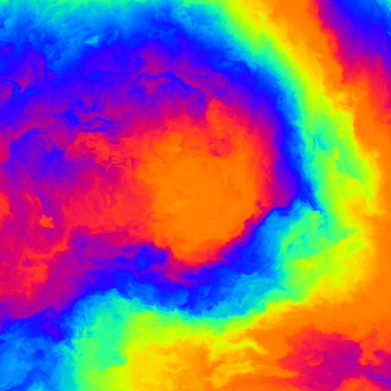
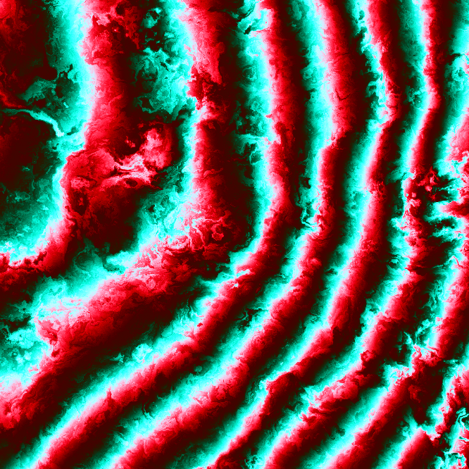
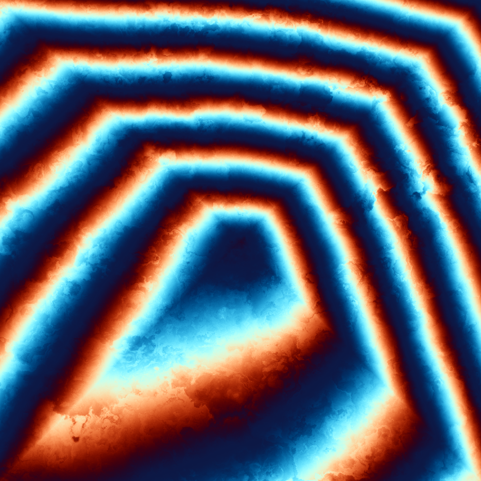

## Warp

- **remote component bundle:** [bundle.js](./bundle.js)
- **thumbnail:** [link](samples/059.png)
- **author:** greweb
- **description:** Welcome to the realm of domain warping. The block style generates many marble-like textures combined with various shape gradients (circles, squares, lines, stars, polygons, etc.). The mods mainly configure the coloring and finetune the noise. Block data drives major features (amount of transactions, big transfers, very light blocks,... will impact the patterns). There are many rare features to discover!

Artist's selected images:

          

---

[source code](index.js)

More previews:

                                                                     