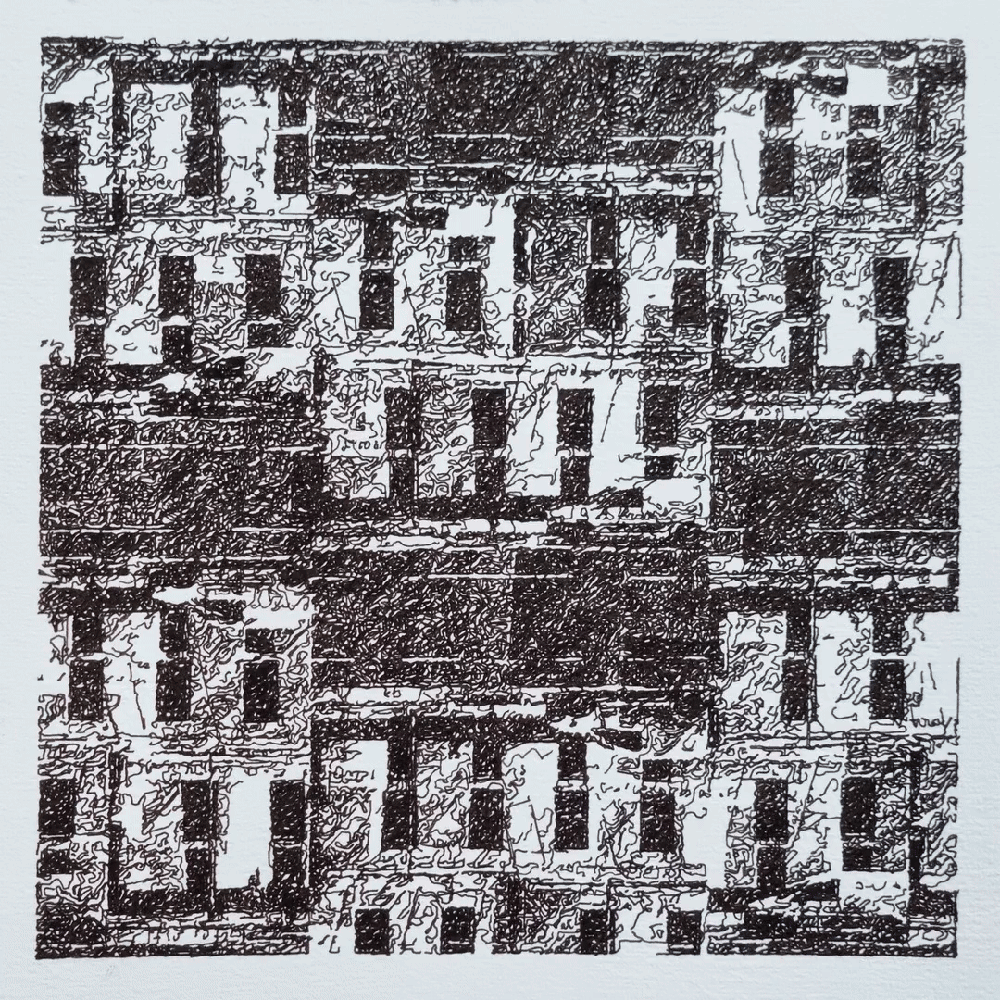

# Analog Patterns

Analog Patterns was eleased on Stargaze on Jan 25, 2024: [link](https://www.stargaze.zone/l/stars17an5h7nel0l4spnvesr7d35gf7cmxewfafxd0su4864ve3a33h8sqy9h9h)

**To get a physical plot, please follow this process: https://greweb.me/plots/nft?stargaze**

The cost is a bit more expensive than a digital mint, since it's physical. It will sometimes be updated (depending on crypto-fiat rates) and to match physical artistic work, plot cost, shipping, etc...

### Description

Analog Patterns is the result of a creative collaboration between the photographers @project_pajon and the generative artist @greweb, known for his plottable creations. The collection focuses on the subtle patterns hidden in the complex natural and human-made environments that we find ourselves in.

The individual unique images are generated with procedural code when minted. 
Each piece of this art collection is created the moment you mint it!
To achieve this the generator uses 100 analog photos from Pajon. For each minted image the generator picks 1 or 2 random photos and composes them using randomly selected collage effects. The rendering is then projected into an only-strokes-version that can be physically plotted with fountain pens (21cm square) and using a random palette of ink.

This hybrid approach, blending photography with procedural code, results in intricate generative outcomes oscillating between realism and abstraction. This highlights the interplay between human and natural patterns and the element of randomness inherent in the artistic process.

## Technical notes

- project started in 2023, roughly 9 months of iterations on the project between @greweb and @project_pajon. Many coding hours and pen prototypes sessions.
- procedural: Everything is made through code, using randomness, but uses a collection of 100 photos from @project_pajon.
- No AI is involved, only procedural code and photography.

## Physical prototypes previews

When working on a generator, I need to test a lot of cases to ensure all cases are physical possible without pen plotter density issues. Here are some of them:

## License

CC BY-NC-ND 4.0

## Technical stack

- [lib.rs](./rust/src/lib.rs) Rust for the generative art logic and SVG generation. Libraries: `serde, serde_json, rand, noise, image, hex, svg`.
- [index.js](./index.js) WASM + WebGL for the frontend rendering. Libraries: `React, gl-react`.

## Other notes from @greweb

Inspired by "Plottable Memories: Train Station" (2022) it uniquely explores the concept of pictorial memory, influenced by @greweb's personal experience with aphantasia.

Analog Patterns focuses on the complex patterns in human and nature.

This work is made with procedural code and we did not pre-curated the results: there are an infinite amount of random variations making each result truly unique even when the same photo could be used between two results. We let randomness play a role in this collection self-curation.

The collection is entirely generated with procedural code that will produce variations over the mints (generative art). The generator uses an album of 100 photos from @Project_pajon collection: each result picks 1-2 random photos and composes them using various random collage effects. The rendering is then projected into only strokes that can be physically plotted with fountain pens (21cm square) and using a random palette of inks.
