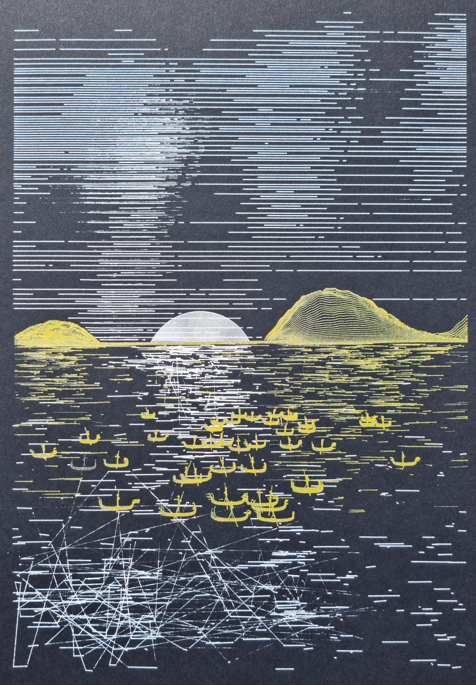
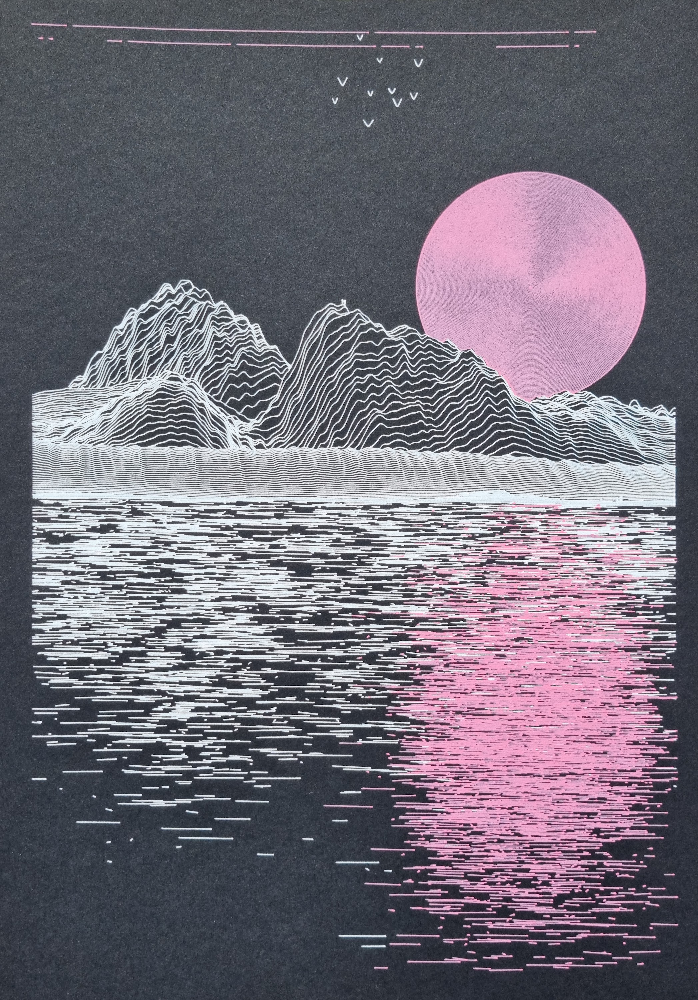
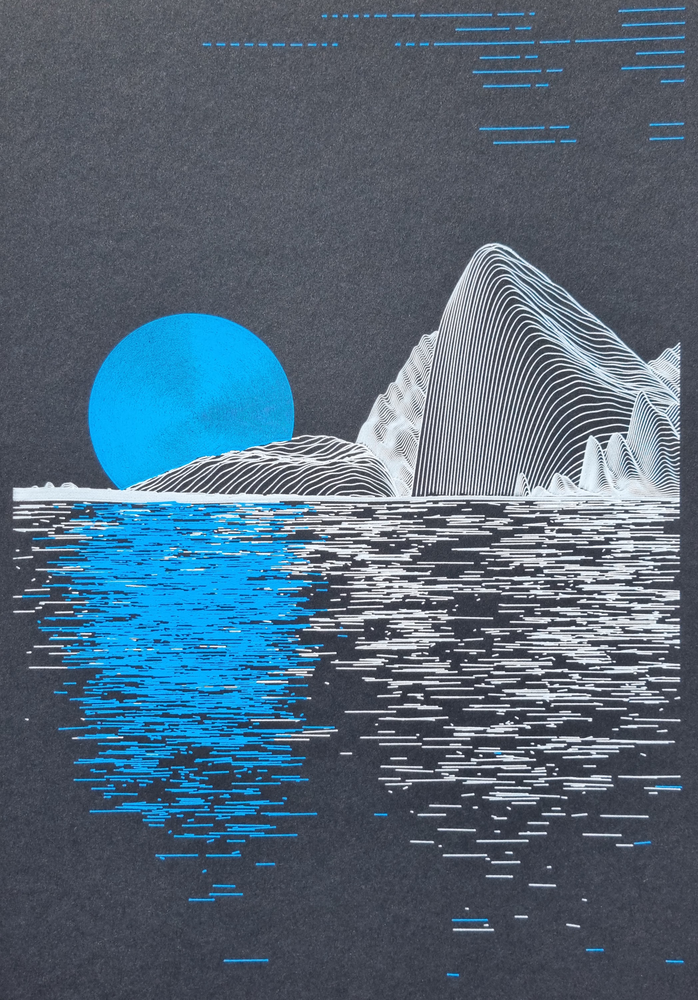
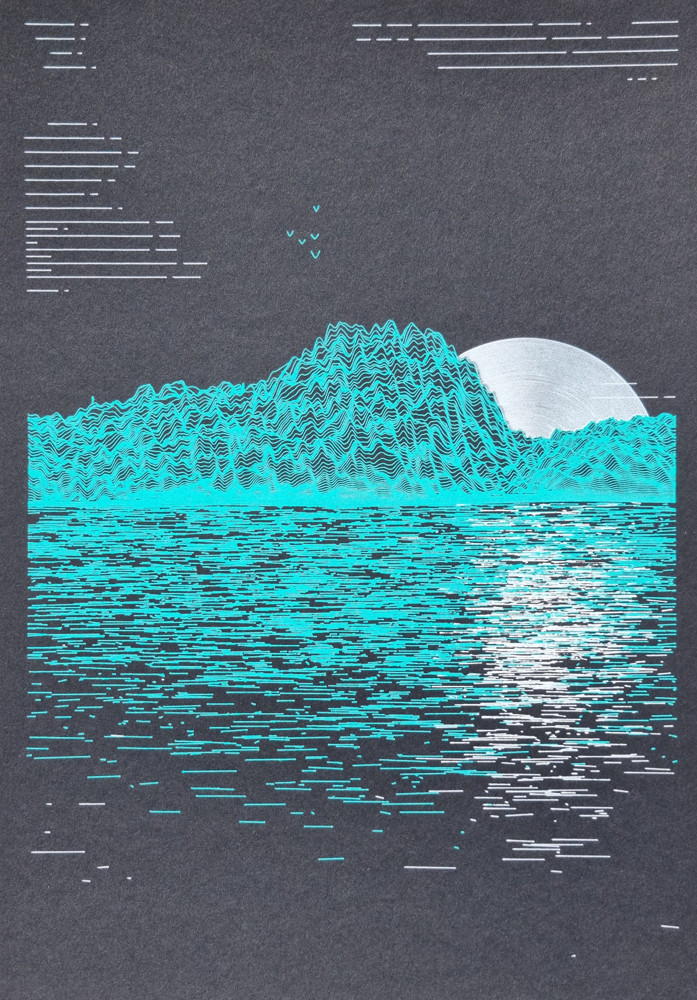
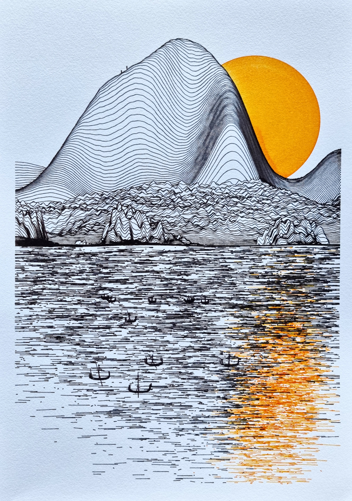
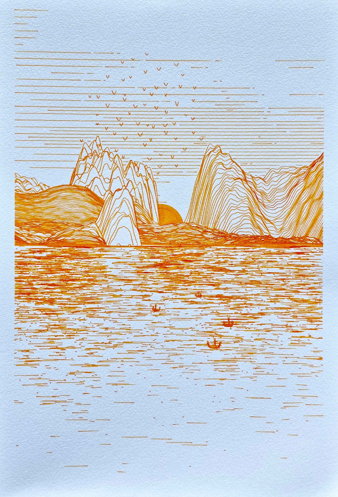
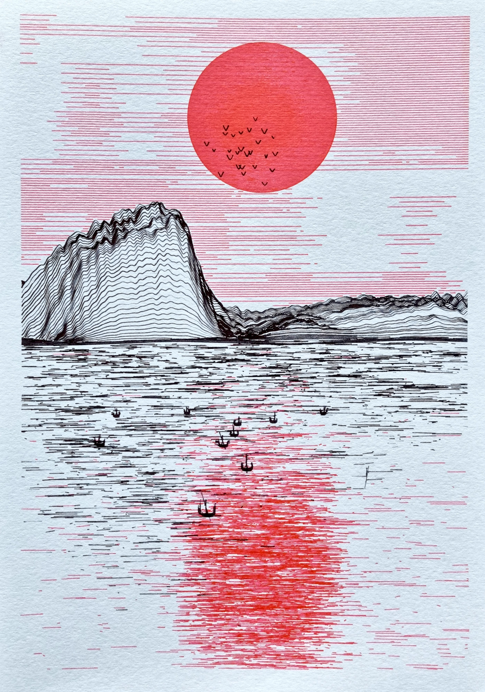
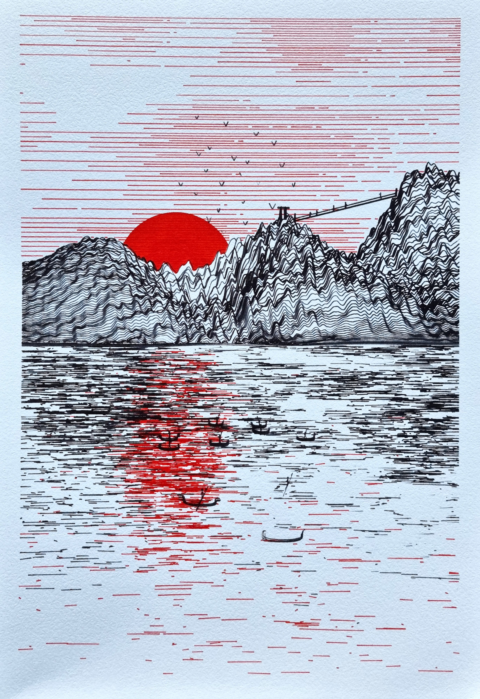
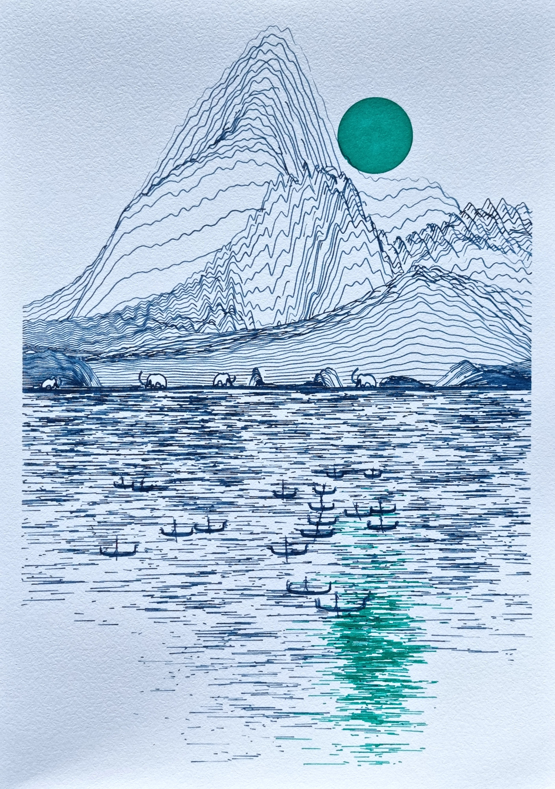

# Plottable Era: (I) Primitive

**Collection on https://www.fxhash.xyz/generative/16313**

'Plottable Era: (I) Primitive' is the first generator in the "Era" generators series, highlighting different periods and civilizations. This first series "Primitive" shows the beginning of mankind with people exploring the mountains and traveling on the sea during sunset.

The digital version simulates ink effects and adds a subtle animation over the water. Each outcome is also physically plottable with pens: A SVG file can be exported (right-click save) to plot the piece physically. The plots are designed to be executed in A4 format on either fountain pens (on white paper) or gel pens (Black / Blue).

Thanks to the utility token decoupling, you can get a physical version: the digital NFT is the recipe to a plottable art piece, owning it confers the right to plot or request a physical plot from @greweb (https://greweb.me/plots/nft). @greweb would use fountain pens but other plotting artists are free to achieve it with their own materials and ship to collectors – as long as NFT is owned at request time.

## Physical protytypes previews

<a href="https://greweb.me/plots/570"></a><a href="https://greweb.me/plots/571"></a><a href="https://greweb.me/plots/572"></a><a href="https://greweb.me/plots/573"></a><a href="https://greweb.me/plots/574"></a><a href="https://greweb.me/plots/575"></a><a href="https://greweb.me/plots/576"></a><a href="https://greweb.me/plots/577"></a><a href="https://greweb.me/plots/578"></a>

## License

CC BY-NC-ND 4.0

## Technical stack

- [lib.rs](./rust/src/lib.rs) Rust for the generative art logic and SVG generation. Libraries: svg, rand, noise, byteorder, serde, serde_json
- [index.js](./index.js) WASM + WebGL for the frontend rendering. Libraries: React and GL-React.

## Features

### Landscape

The landscape is shaped with mountains that are reflected on water on half of the piece. A sun will also set behind the mountains. Cloud can be drawn in the sky with sun's color (clouds are lignten by the sun).

Here are the associated features and theorical probabilities.

```
Cloud Density
                         Small: 40.7%
                        Medium: 34.6%
                          High: 12.4%
                        <none>: 8.4%
                     Very High: 3.9%

Elevation
                       Regular: 46.6%
                           Low: 20.6%
                          High: 18.7%
                     Very High: 5.7%
                      Very Low: 4.9%
                       Extreme: 3.5%

Sun Radius
                        Medium: 36.8%
                           Big: 31.1%
                         Small: 20.2%
                      Very big: 11.9%

Sunset
                    In-between: 44.5%
                   Not Started: 31.5%
                     Beginning: 13.8%
                        Ending: 8.3%
                      Finished: 1.8%
```

### Elements

Various kind of items and placed in the world: birds, boats and humans walking on the mountain.

Here are the associated features and theorical probabilities.

```
Birds
                        Colony: 46.1%
                        <none>: 40.4%
                           Few: 11.8%
                         Alone: 1.8%

Boats
                           Few: 30.4%
                          Many: 26.5%
                        <none>: 22.6%
                          Solo: 11.9%
                           Duo: 8.6%

People
                        <none>: 36.8%
                          Many: 23.8%
                           Few: 23.7%
                          Solo: 8.9%
                           Duo: 6.9%

Mammoth
                        <none>: 66.8%
                           One: 16.7%
                           Two: 8.8%
                           Few: 7.2%
                          Many: 0.6%
Menhir
                        <none>: 64.6%
                          Many: 10.4%
                           Few: 10.3%
                           One: 8.2%
                           Two: 6.6%

Tipi
                        <none>: 86.1%
                           One: 7.8%
                           Two: 3.1%
                           Few: 2.5%
                          Many: 0.5%

Fire
                        <none>: 92.3%
                           One: 5.2%
                           Two: 1.5%
                           Few: 0.9%
                          Many: 0.1%

Bridge
                        <none>: 78.2%
                           Yes: 21.8%
```

### Pen and papers

The generator uses 3 main color schemes, ruled by the paper used underneath: `Black` paper will be used with gel pens, `Blue` paper will be used exclusively with black and white and `White` paper is a regular paper to use with fountain pen inks.

```
Paper
                         white: 45.6%
                         black: 44.3%
                          blue: 10.1%

Inks Count
                             2: 92%
                             1: 8%

Inks
          Gel Gold + Gel White: 17.8%
                 Amber + Black: 9.8%
             Black + Gel White: 9.8%
           Gel Red + Gel White: 7.4%
                  Black + Pink: 5.7%
         Gel Green + Gel White: 5.2%
             Black + Poppy Red: 5.0%
        Gel Orange + Gel White: 4.8%
                Amber + Indigo: 3.4%
                         Amber: 2.9%
          Gel Blue + Gel White: 2.7%
                     Gel White: 2.6%
                 Indigo + Pink: 2.0%
               Black + Pumpkin: 1.7%
                  Amber + Pink: 1.6%
            Indigo + Poppy Red: 1.6%
             Amber + Poppy Red: 1.3%
             Black + Hope Pink: 1.3%
            Amber + FireAndIce: 1.0%
          ...
```
