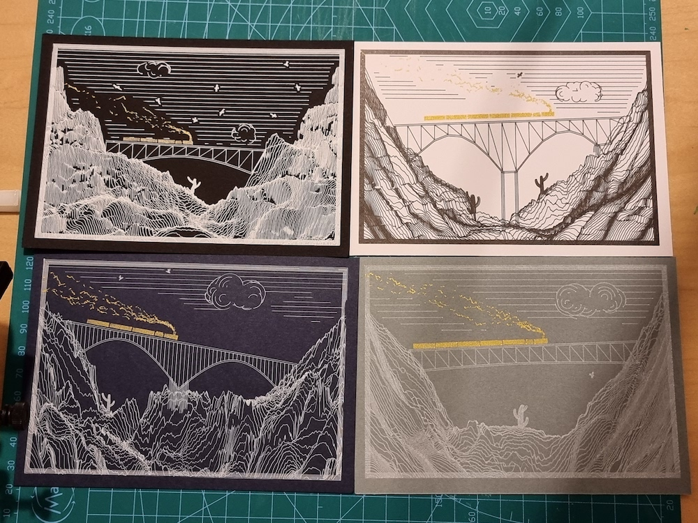
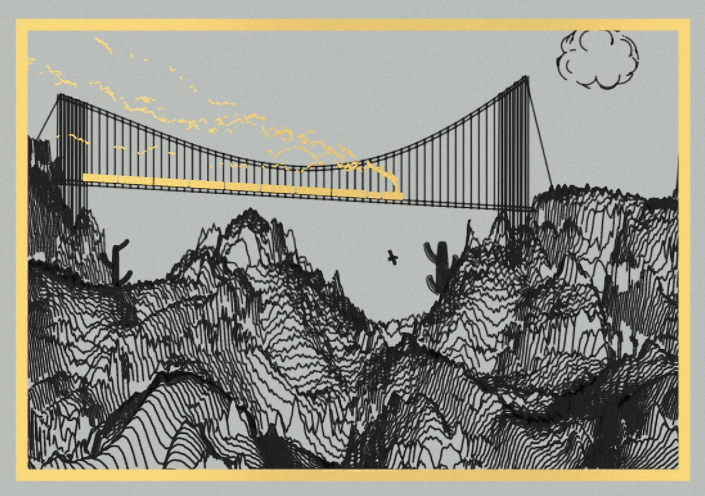

<!--
Plan:
Supply: 400
Price: 888 STARS
whitelist premint 50%
Allowlist to <insertaddress> to be able to mint 60 NFT during the "pre-mint" phase, before it is "public".
-->

# Plottable Golden Train

Introducing Plottable Golden Train - a generator of plottable art piece, intended to be plotted on A6-sized paper. Golden Train features a sleek train with multiple carriages, a bridge, various elements like cactus, eagles,...

The NFT is the recipe to a physically plottable art piece, it exports a SVG that you can plot with pens. owning it confers the right to plot or request a physical plot from the artist (extra cost for the physical derivatives) using this link: https://greweb.me/plots/nft
 – The artist would use fountain pens and gel pens to achieve the final product, but other plotting artists are free to use their own materials and ship to collectors as long as the NFT is owned at the time of the request.

For those interested in the technical details, this work was created using WebGL + Rust + WASM and is licensed under CC BY-SA 4.0. Additional information and the source code for this piece can be found at this link: https://github.com/gre/gre/tree/master/doodles/plottable-golden-train

Part of this collection was pre-minted in context of a collaboration with [Astroquirks](https://astroquirks.com/) validator.

## Released on... PublicWorks.Art -> Cosmos / Stargaze blockchain!

I've been releasing work in the past on Ethereum and Tezos. This time, I chose to try another platform and another blockchain. Cosmos is a very innovative blockchain and I'm happy to expand territories of my art minting the first plottable NFT on Cosmos / Stargaze blockchain.

My work will be released on https://publicworks.art/ which itself will allow to mint on https://www.stargaze.zone/


## Physical protytypes previews

Many prototypes were made to reveal the generator as well as stress test its physical results.



## A cool digital display

As always, my work is also animated and the digital version accurately reproduces what could the physical look like.



https://youtu.be/FHd7OF-QVSY

## Theorical features

```
Bridge
                Regular Bridge: 38.9%
       Regular Reversed Bridge: 15.8%
          Regular Small Bridge: 15.2%
                 Double Bridge: 7.2%
 Regular Reversed Small Bridge: 6.1%
                Complex Bridge: 3.6%
        Double Reversed Bridge: 3.0%
           Double Small Bridge: 2.6%
            Regular Big Bridge: 1.7%
       Complex Reversed Bridge: 1.6%
          Complex Small Bridge: 1.2%
  Double Reversed Small Bridge: 1.1%
 Complex Reversed Small Bridge: 0.6%
   Regular Reversed Big Bridge: 0.4%
             Double Big Bridge: 0.4%
            Complex Big Bridge: 0.2%
    Double Reversed Big Bridge: 0.1%
   Complex Reversed Big Bridge: 0.1%
Cactus Density
                     undefined: 66.5%
                           Low: 31.8%
                          High: 1.6%
                       Extreme: 0.1%
Cloud Density
                           Low: 51.8%
                        Medium: 26.1%
                          High: 22.1%
                     undefined: 0.0%
Eagle Density
                           Low: 84.4%
                          High: 14.5%
                       Extreme: 1.1%
Gold Border
                     undefined: 93.0%
                           Yes: 7.0%
Inks
                  Black + Gold: 55.1%
                  Gold + White: 38.6%
                         Black: 2.7%
                          Gold: 1.8%
                         White: 1.7%
Inks Count
                             2: 93.8%
                             1: 6.2%
Paper
                         White: 54.6%
                         Black: 32.0%
                     Dark Blue: 7.0%
                          Grey: 6.3%
Precipice
                       Regular: 46.2%
                      Moderate: 28.5%
                          Deep: 21.4%
                     Very Deep: 3.9%
Total Cactus
                     undefined: 66.5%
                             1: 20.9%
                             2: 7.0%
                             3: 2.4%
                             4: 1.4%
                             5: 0.7%
                             6: 0.5%
                             8: 0.2%
                             7: 0.2%
                             9: 0.1%
                            10: 0.1%
                            13: 0.0%
                            11: 0.0%
                            12: 0.0%
                            14: 0.0%
Total Carriages
                             3: 21.4%
                             2: 20.1%
                             1: 17.5%
                             4: 14.0%
                     undefined: 8.7%
                             5: 7.6%
                             6: 5.0%
                             7: 3.1%
                             8: 1.6%
                             9: 0.6%
                            10: 0.3%
                            11: 0.1%
Total Eagles
                             1: 53.9%
                             2: 15.6%
                             3: 8.8%
                             4: 6.1%
                             5: 3.7%
                             6: 2.9%
                             7: 2.0%
                             8: 1.7%
                             9: 1.2%
                            10: 1.0%
                            11: 0.7%
                            12: 0.7%
                            13: 0.3%
                            14: 0.3%
                            15: 0.3%
                            16: 0.2%
                            17: 0.1%
                            18: 0.1%
                            19: 0.1%
                            21: 0.1%
                            20: 0.1%
                            22: 0.1%
                            23: 0.1%
                            24: 0.0%
                            25: 0.0%
                            27: 0.0%
                            28: 0.0%
                            30: 0.0%
Train Slope
                          Flat: 44.2%
                        Gentle: 33.0%
                      Moderate: 17.5%
                         Steep: 5.2%
Warping Effect
                           Low: 60.5%
                          High: 20.2%
                        Medium: 19.3%
```

## License

CC BY-NC-ND 4.0

## Technical stack

- [lib.rs](./rust/src/lib.rs) Rust for the generative art logic and SVG generation. Libraries: svg, noise, rand, bs58, serde, instant, serde_json
- [index.js](./index.js) WASM + WebGL for the frontend rendering. Libraries: React and GL-React.
