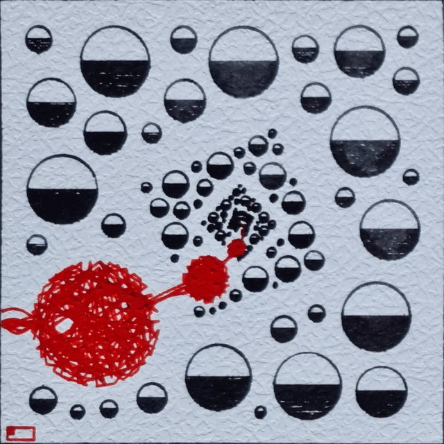
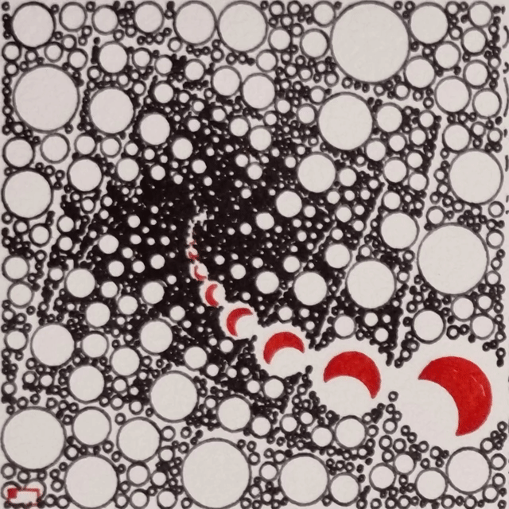

# Plottable Circleception (8 frames)



**A collection on [fx(hash)](https://www.fxhash.xyz/generative/14692)**

'Circleception' explores fractal-like zoom loops (the art infinitely reproduces inside itself), packing circles, filled with various techniques.

A SVG file can be exported (right-click save) to plot the 8 frames of this animation on a A4 paper. This is a "plot loop". The physical piece is displayed as aesthetics 4x2 grid of the frames. The animation is meant to be run at 16 FPS speed.

You can enjoy the digital version that simulates ink effects. But also, thanks to the utility token decoupling, get a physical one: the digital NFT is the recipe to a plottable art piece, owning it confers the right to plot or request a physical plot from @greweb (https://greweb.me/plots/nft). @greweb would use fountain pens but other plotting artists are free to achieve it with their materials and ship to collectors – as long as NFT is owned at request time.



---

## License

CC BY-NC-ND 4.0

## Technical stack

- [lib.rs](./rust/src/lib.rs) Rust for the generative art logic and SVG generation. Libraries: svg, noise, rand, byteorder, serde, serde_json, pointy, geo
- [index.js](./index.js) WASM + WebGL for the frontend rendering. Libraries: React and GL-React.

## Theorical rarity of features

There are many variety to discover, yet the generator supply is relatively low. The rule of thumb I follow is that at least one property need to have the likelyhood of nearly not being minted – but only the randomness will decide!

```
Everything animates
                     undefined: 93.4%
                           Yes: 6.6%
Frame
                        Cordon: 37.0%
                        Simple: 33.5%
                     undefined: 29.5%
General Shape
                        Simple: 46.4%
                HalfConcentric: 17.4%
                          Half: 11.4%
                        Spiral: 9.8%
                    Concentric: 8.4%
                          None: 3.8%
                          Moon: 2.8%
General Shape Amount
                        Medium: 69.6%
                          High: 21.9%
                           Low: 4.5%
                          None: 3.8%
                     Very High: 0.2%
Inception
                          High: 45.1%
                        Medium: 27.0%
                     Very High: 22.6%
                           Low: 5.3%
Rotation
                           Low: 37.5%
                          None: 32.2%
                        Medium: 16.0%
                       Angular: 8.1%
                          High: 6.2%
Special Shape
                        Random: 27.4%
                    Concentric: 20.3%
                        Spiral: 12.4%
                          Moon: 10.0%
                        ZigZag: 9.5%
                          Half: 8.5%
                          None: 5.6%
                        Simple: 4.4%
                HalfConcentric: 1.9%
Theme
                         Light: 78.7%
                          Dark: 21.3%
Translation
                        Medium: 35.6%
                           Low: 34.6%
                          High: 21.4%
                          None: 7.5%
                     Very High: 0.9%
With Cordon
                     undefined: 57.8%
                           Yes: 42.2%
Zoom Direction
                        Inside: 61.2%
                       Outside: 38.8%
```
