# Plottable Field (8 frames)

**Collection on https://www.fxhash.xyz/generative/13643**

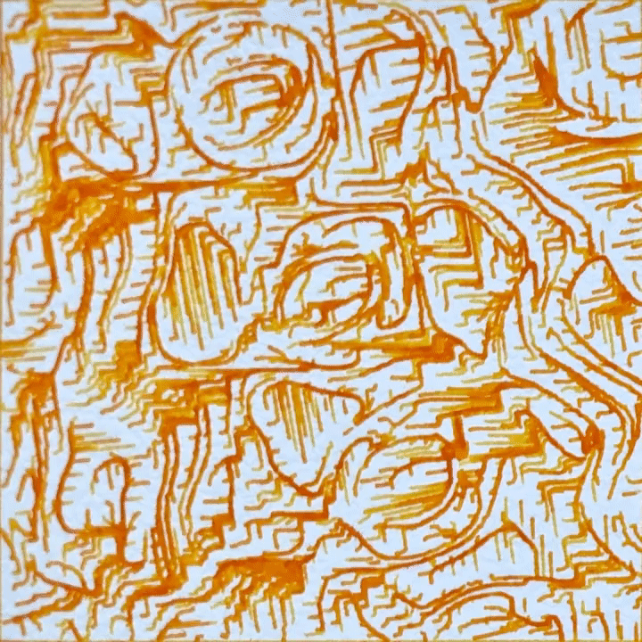

'Field' explores the realm of noise field distortions through many different primitives: 15 unique distributions, 16 possible inks, and many kinds of distortions, ink combinations, and animations,...

A SVG file can be exported (right-click save) to plot the 8 frames of this animation on a A4 paper. This is a "plot loop". The physical piece is displayed as aesthetics 4x2 grid of the frames.

You can enjoy the digital version that simulates ink effects. But also, thanks to the utility token decoupling, get a physical one: the digital NFT is the recipe to a plottable art piece, owning it confers the right to plot or request a physical plot from @greweb (https://greweb.me/plots/nft). @greweb would use fountain pens but other plotting artists are free to achieve it with their materials and ship to collectors – as long as NFT is owned at request time.

---

**I put a lot of effort at stress testing the physical plot to make sure there are possible and interesting: 22 unique prototypes has been plotted! It was a lot of work!** That means there is a total of 176 individual plots that has been made.

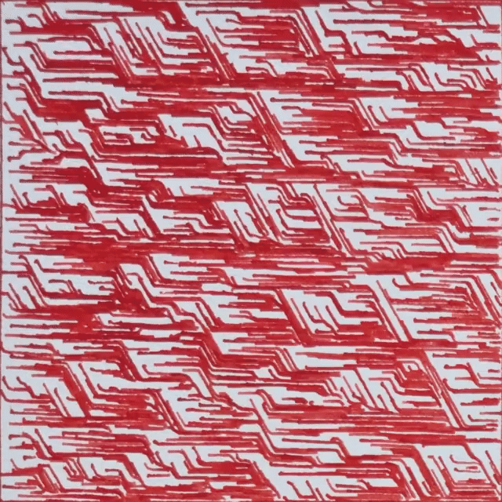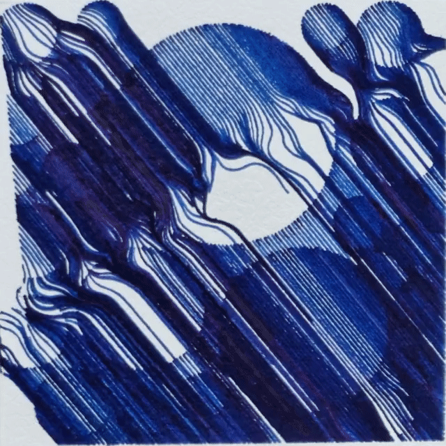</a><a href="https://greweb.me/plots/518">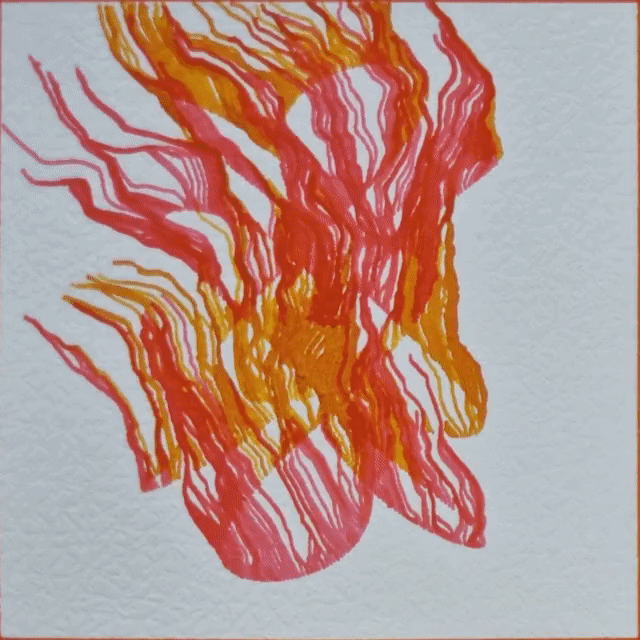</a><a href="https://greweb.me/plots/519">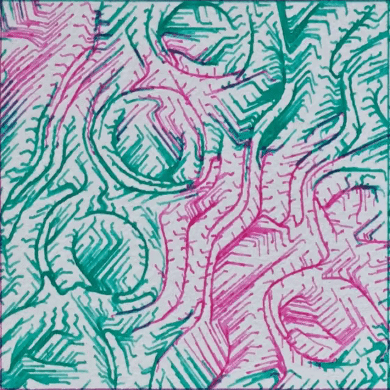</a><a href="https://greweb.me/plots/520">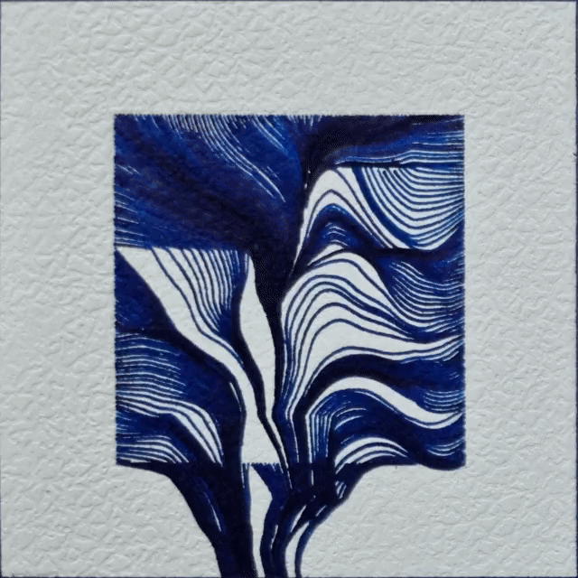</a><a href="https://greweb.me/plots/521">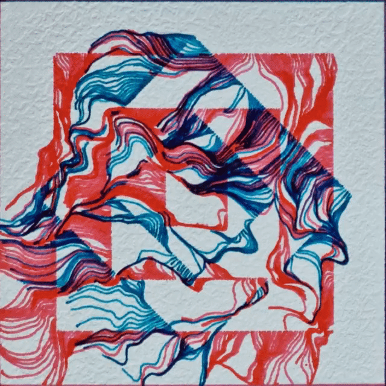</a><a href="https://greweb.me/plots/522">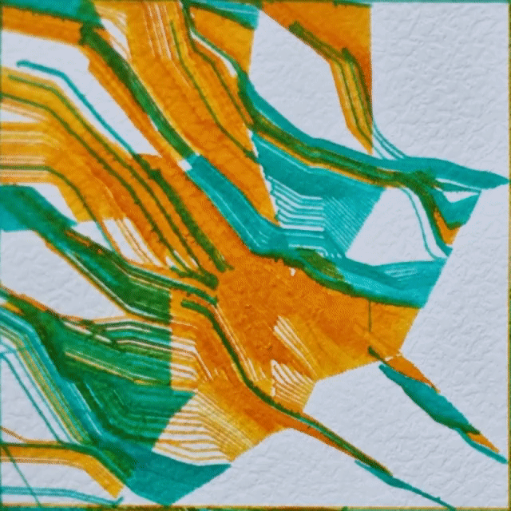</a><a href="https://greweb.me/plots/523">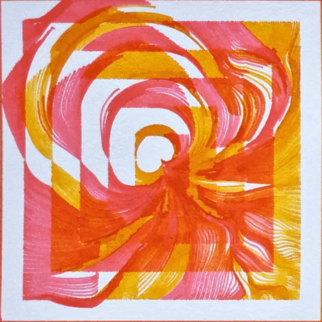</a><a href="https://greweb.me/plots/524">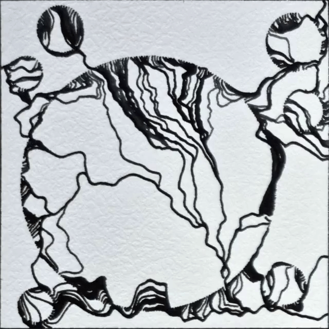</a><a href="https://greweb.me/plots/525">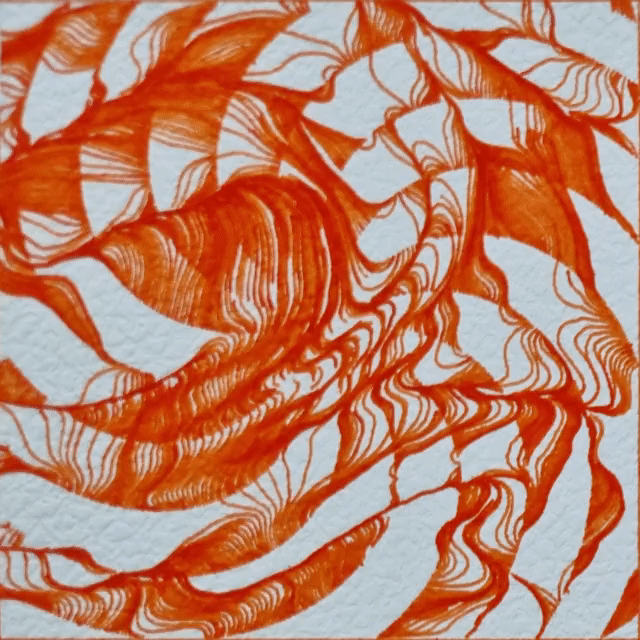</a><a href="https://greweb.me/plots/526">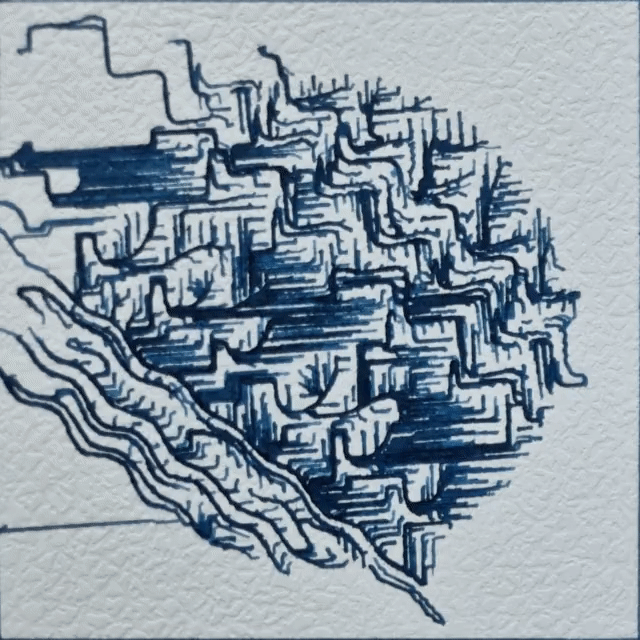</a><a href="https://greweb.me/plots/527">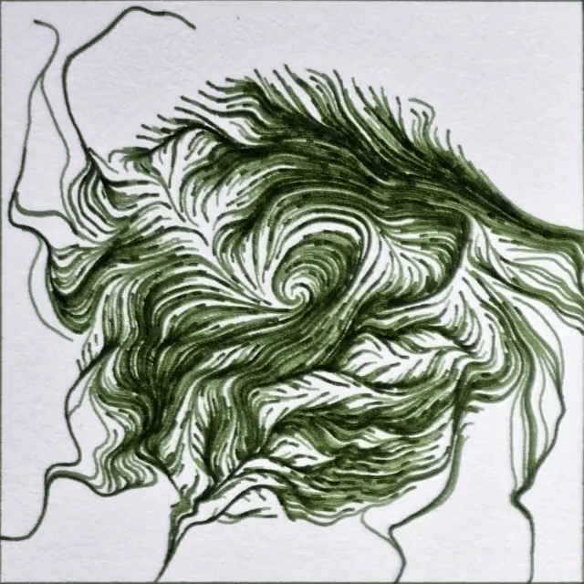</a><a href="https://greweb.me/plots/528">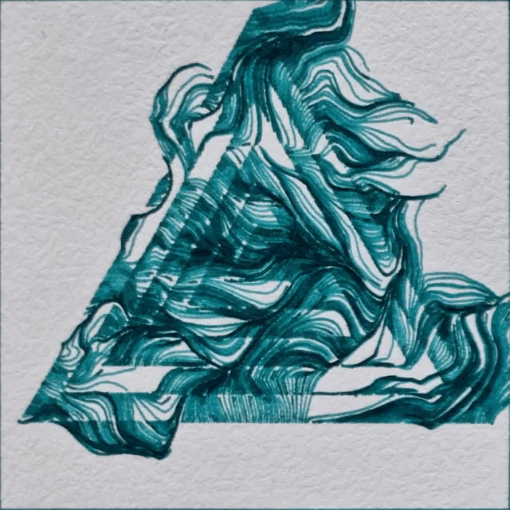</a><a href="https://greweb.me/plots/529">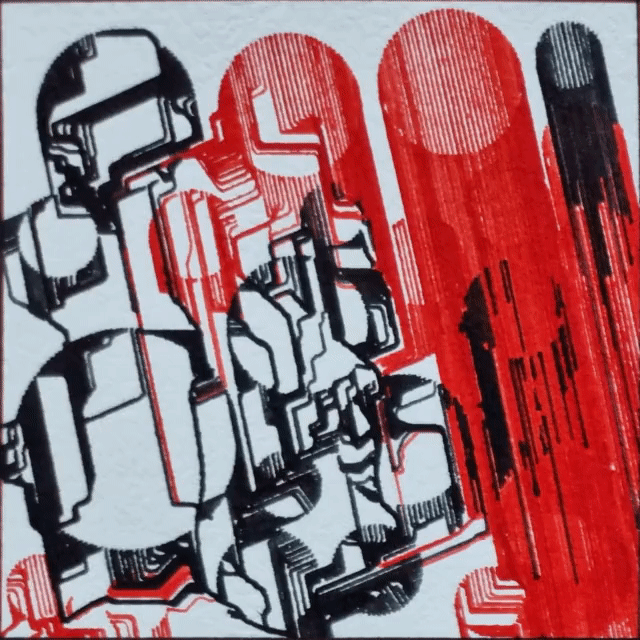</a><a href="https://greweb.me/plots/530">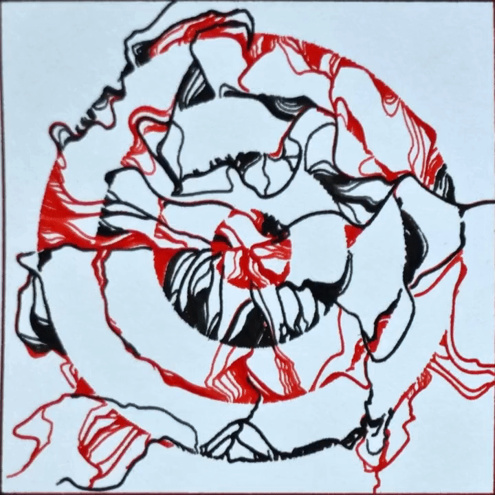</a><a href="https://greweb.me/plots/531">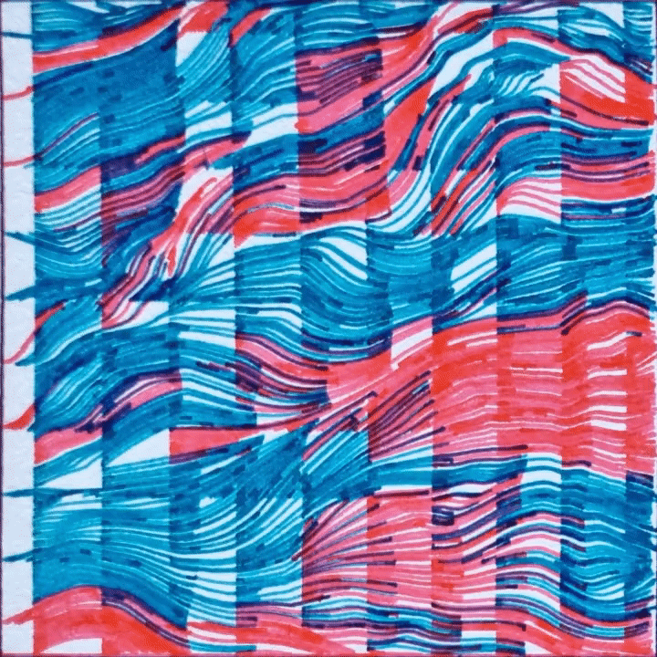</a><a href="https://greweb.me/plots/532">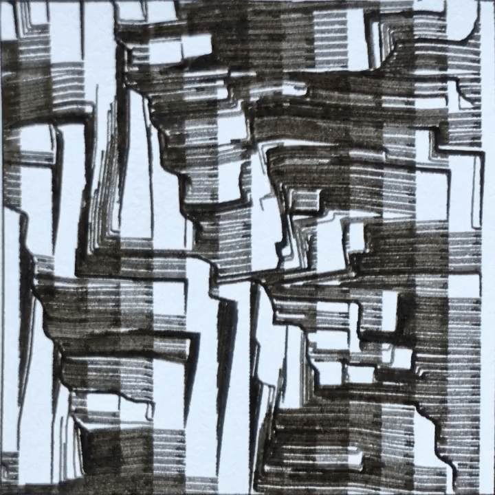</a><a href="https://greweb.me/plots/533">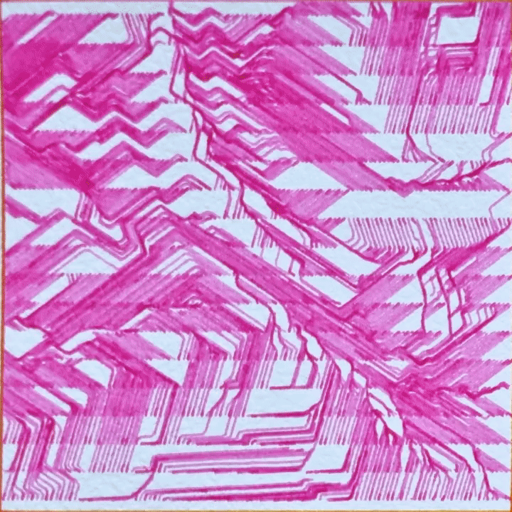</a><a href="https://greweb.me/plots/534">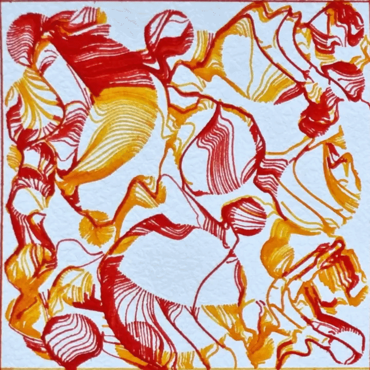</a><a href="https://greweb.me/plots/535">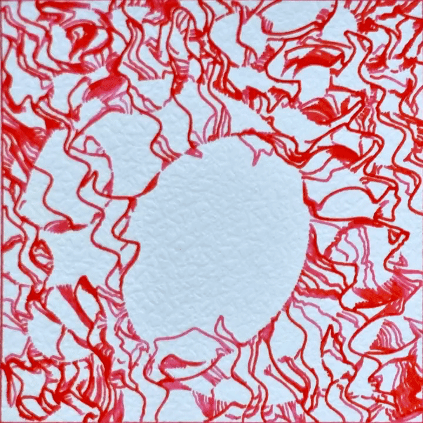</a><a href="https://greweb.me/plots/536">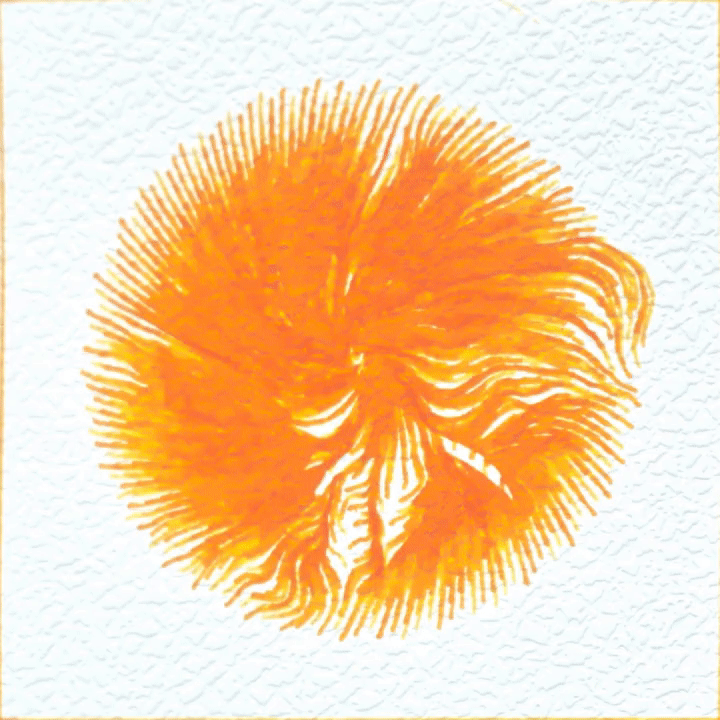</a><a href="https://greweb.me/plots/537"></a>

## License

CC BY-NC-ND 4.0

## Technical stack

- [lib.rs](./rust/src/lib.rs) Rust for the generative art logic and SVG generation. Libraries: svg, noise, rand, byteorder, serde, serde_json, voronoi
- [index.js](./index.js) WASM + WebGL for the frontend rendering. Libraries: React and GL-React.

## Distribution

The 'distribution' determines all the initial positions to construct lines from. There are 15 kind of distributions with various rarity. Here is the theorical probabilities:

```
Distribution
                    GoldSpiral: 21.1%
                 NestedSquares: 11.1%
                       Voronoi: 10.2%
                 NestedCircles: 7.4%
                       Circles: 7.2%
                    MillSpiral: 6.4%
              GoldSpiralCircle: 5.2%
                TriangleSpiral: 4.8%
                    Parametric: 4.8%
                    CrossLines: 4.4%
               NestedTriangles: 4.3%
                        XLines: 4.1%
                        YLines: 3.4%
                 DoubleCircles: 3.3%
                         Curve: 2.3%
```

## Noise field

Once the initial points are chosen by the distribution, lines are then thrown in a noise field (a random flow) following various kind of rules.

The noises can vary in so many ways and each pieces will have unique features. In term of "features", we have a few summary of the properties of the noise, and here are some probabilities:

```
Noise Amp
                        Medium: 45.8%
                          High: 40.2%
                           Low: 10.2%
                     Very High: 3.8%
Noise Animation
                        Normal: 27.9%
                          Fast: 18.1%
                          Slow: 17.0%
                       Intense: 14.6%
              Partially Normal: 5.1%
                          None: 3.8%
                     Very Slow: 3.8%
                Partially Fast: 3.6%
                Partially Slow: 3.1%
             Partially Intense: 2.3%
           Partially Very Slow: 0.7%
Noise Frequency
                        Medium: 58.5%
                           Low: 35.2%
                          High: 6.3%
```

I let you discover these.

We also have other features at stake impacting the noises:

- a circle packing can be used to impact the noise
- a grid can be used
- The "Angle Mod" will sometimes impact the field and make it more "angular" to create more square / triangle / hexagonal shapes in the field itself.
- A rare "center effect" can have an attraction / push away role in the noise field

## Color distribution

Most of the time, only one ink is used. In other case, there will be 2 inks at use, and the way they are split can vary in many ways. They are expressed in the "features" of the generator. Here are some probabilities:

```
                        (none): 63.3%
                         Group: 8.6%
                       X-Split: 3.7%
                         45deg: 3.7%
                       Y-Split: 2.9%
                Y-Split, 45deg: 2.6%
                X-Split, 45deg: 2.2%
              X-Split, Y-Split: 2.1%
                  X-Split, Rot: 1.6%
       X-Split, Y-Split, 45deg: 1.2%
                       Circles: 1.0%
                X-Split, Group: 1.0%
                ... and many more combinations
```

Feel free to ask me any questions about them, I'll let you discover what they all are :)

The inks have themself some probability of combinations. In this generator, here is the probabilities:

```
Inks
                         Black: 12.9%
                         Amber: 8.0%
                 Bloody Brexit: 5.2%
                  WhiteOnBlack: 4.6%
                          Pink: 4.5%
                     Hope Pink: 3.8%
                    FireAndIce: 3.5%
                     Soft Mint: 3.4%
                     Poppy Red: 2.7%
            Amber + FireAndIce: 2.6%
                     Evergreen: 2.6%
                  Amber + Pink: 2.4%
             Amber + Hope Pink: 2.2%
               Imperial Purple: 2.1%
             Amber + Soft Mint: 1.9%
                        Indigo: 1.9%
                        ... way more combinations
```

### Many animations to discover

This is also a plot loop and we are continuing exploring the beauty of animating noises using the cylinder technique shared by this diagram:

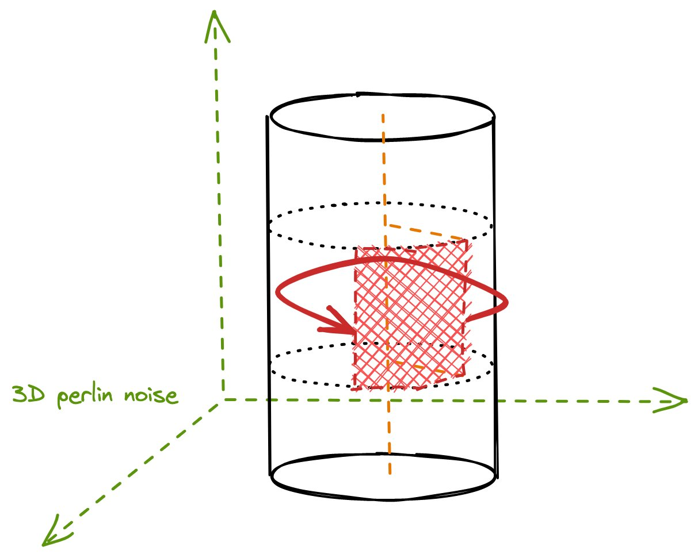
