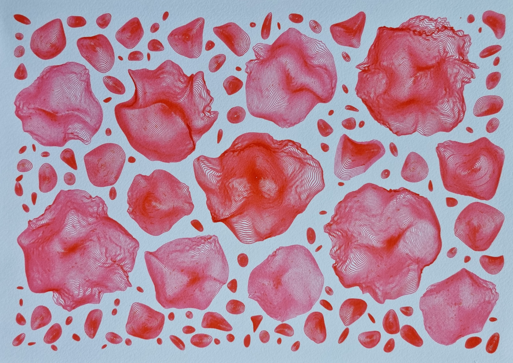

# Plottable Slimes

**Collection on https://www.fxhash.xyz/generative/18109**

This work explore very slimy objects, packed on a A4 canvas. The generator suggests different kind of paper and ink for the plotter artist to use: white, black, blue, red,... This is designed to be used with Fountain Pen (for white paper) and gel pens (for colored paper).

The outcomes of the generator have consistency: there is a main slime in the middle, sometimes being "highlighed" with another color, and other slimes are distributed on the space around it. This makes the piece more organic and distributed.

Nevertheless, there are many different variations and features to discover, expressed in the "Shape" feature.

> _Theorical distribution:_

```
Shape
                         Slime: 56.2%
                  Smooth Slime: 24.8%
                          Snow: 7.7%
                Low-Poly Slime: 3.0%
                   Smooth Snow: 2.7%
                          Wind: 2.6%
         Smooth Low-Poly Slime: 1.6%
                   Smooth Wind: 1.4%
```

This work is the result of months of exploration around this concept of "Polar Mountains" and projections in polar coordinates. I only figured how recently how I wanted the packing to work, thanks to some home cooked algorithm of packing bitmap technique.

## Physical protytypes previews

Many prototypes were made to reveal the generator as well as stress test its physical results.

<a href="https://greweb.me/plots/621"></a><a href="https://greweb.me/plots/622"></a><a href="https://greweb.me/plots/623"></a><a href="https://greweb.me/plots/624"></a><a href="https://greweb.me/plots/625"></a><a href="https://greweb.me/plots/626"></a><a href="https://greweb.me/plots/627"></a><a href="https://greweb.me/plots/628"></a><a href="https://greweb.me/plots/629"></a><a href="https://greweb.me/plots/630"></a><a href="https://greweb.me/plots/631"></a><a href="https://greweb.me/plots/632"></a><a href="https://greweb.me/plots/633"></a>

## License

CC BY-NC-ND 4.0

## Technical stack

- [lib.rs](./rust/src/lib.rs) Rust for the generative art logic and SVG generation. Libraries: svg, noise, rand, bs58, serde, instant, serde_json
- [index.js](./index.js) WASM + WebGL for the frontend rendering. Libraries: React and GL-React.

## Other theorical distributions

This controls the fact the lines can "go inside" the shapes. It increase the contouring effect, especially powerful with fountain pens.

```
Curving
                        Strict: 55.1%
                       Contour: 25.7%
                        Inside: 19.2%
```

These are the Paper and Ink distributions

```
Inks
             Black + Gel White: 19.7%
                     Gel White: 15.7%
          Gel Gold + Gel White: 9.1%
                         Black: 7.6%
                         Amber: 4.7%
                 Amber + Black: 3.9%
           Gel Red + Gel White: 3.5%
                  Black + Pink: 3.2%
                      Gel Gold: 3.0%
             Black + Poppy Red: 2.7%
                     Poppy Red: 2.5%
                 Bloody Brexit: 2.4%
                       Gel Red: 2.2%
                          Pink: 2.2%
          Gel Blue + Gel White: 2.1%
         Gel Green + Gel White: 1.3%
             Black + Hope Pink: 1.2%
                            ...
Inks Count
                             2: 54.7%
                             1: 45.3%
Paper
                         black: 32.8%
                         white: 32.3%
                          blue: 19.9%
                           red: 15.0%
```

These are other properties that analyzes the intensity of the shapes, the padding between them, their size, amount of shapes,...

```
Intensity
                        Medium: 47.7%
                       Intense: 39.3%
                         Light: 9.5%
                       Extreme: 3.5%
Padding
                        Normal: 38.8%
                       Distant: 38.7%
                         Tight: 16.1%
                     undefined: 6.4%
Size
                        Medium: 58.4%
                           Big: 22.2%
                         Small: 19.4%
Slimes
                          Many: 59.2%
                          Some: 27.2%
                         A lot: 7.2%
                           Few: 6.4%
```
