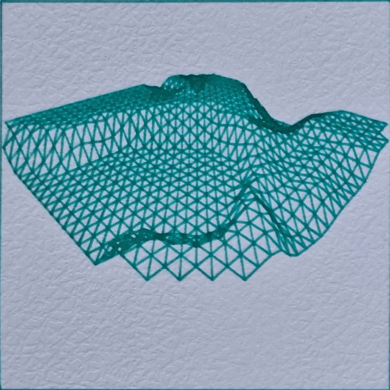
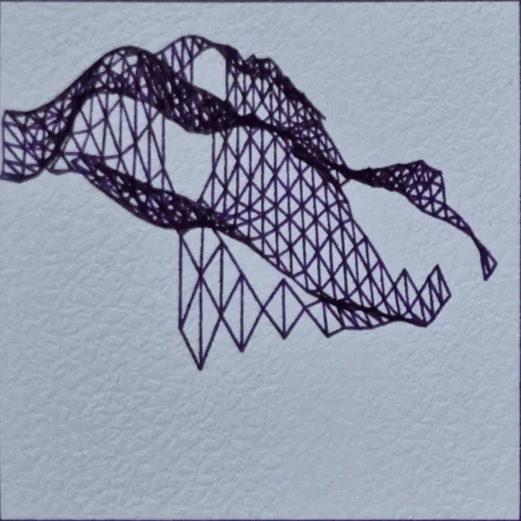
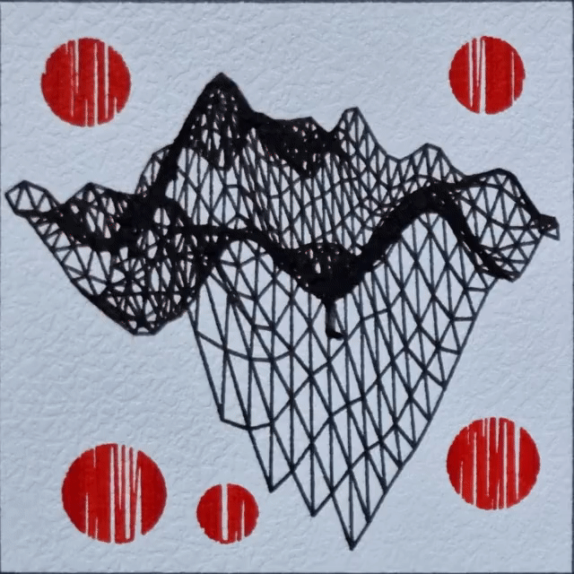
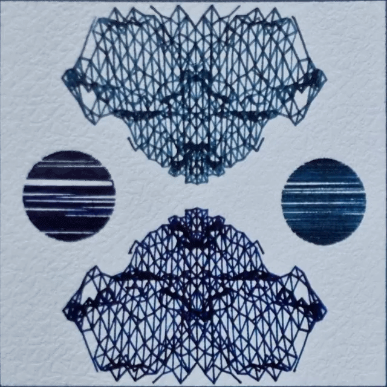
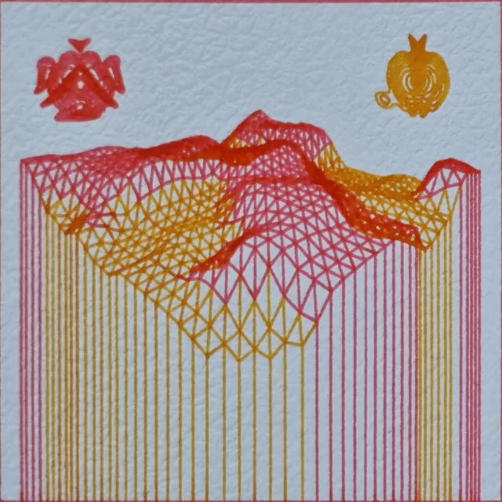
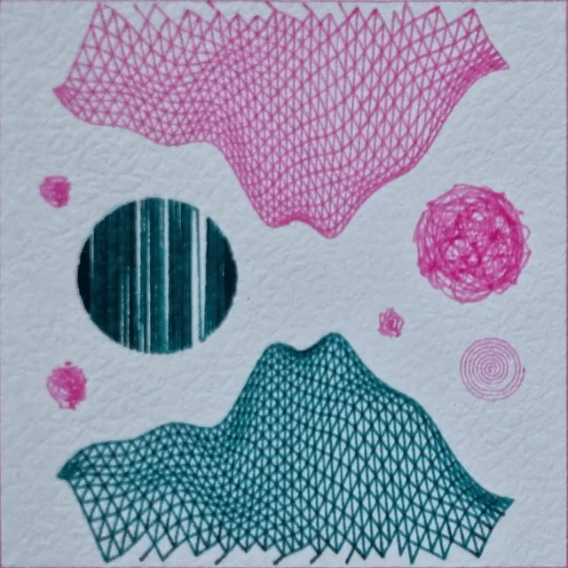
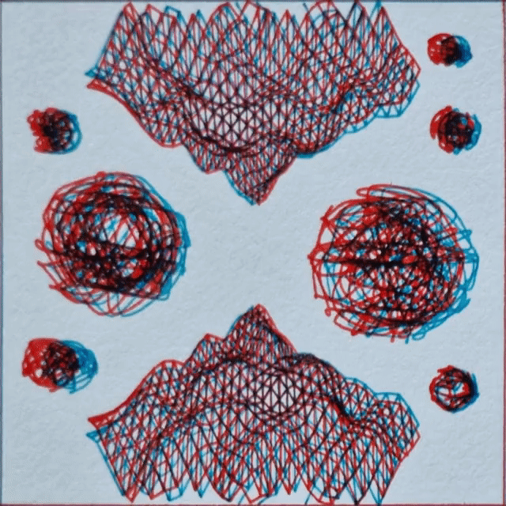

<!--
price 16 12 10 8 6 4 3 2 – every day
supply 500
ooVPUnRhyTkhNkZoMPMx3MoGQDSB5dZtaZroNHJiXcF1myLC76E

Tags: plottable, plotloop, webgl, svg, rust, wasm, A4, physical, phygital
-->

# Plottable Wireframe (8 frames)

More info: https://greweb.me/plots/516

'Wireframe' explores the realm of 3D noise mixed with various generative techniques. Many rare features and easter eggs are to discover.

A SVG file can be exported (right click save) to plot the 8 frames of this animation on a A4 paper.

You can enjoy the digital version that simulate ink effects and optional, thanks to the utility token decoupling, get a physical one: the digital NFT is the recipe to a plottable art piece, owning it confers the right to plot or request a physical plot from @greweb (https://greweb.me/plots/nft). @greweb would use fountain pens but other plotting artists are free to interprete it with their own materials and ship to collectors – as long as NFT is owned at request time.

<!--
@greweb – 2022 – tech: WebGL + Rust + WASM – CC BY-SA 4.0 https://creativecommons.org/licenses/by-sa/4.0/
-->

## License

CC BY-NC-ND 4.0

## Technical stack

- [lib.rs](./rust/src/lib.rs) Rust for the generative art logic and SVG generation. Libraries: svg, noise, rand, byteorder, kiss3d, contour, geojson, serde, serde_json
- [index.js](./index.js) WASM + WebGL for the frontend rendering. Libraries: React and GL-React.

## Release

This generator will be released on Saturday 21th May 2022 as a [FX(hash) generator](https://www.fxhash.xyz/u/greweb) on which people can collect variants of output of the generator as an NFT. That can later be used to request me a physical plot on https://greweb.me/plots/nft.

This will be the first generative plot loop on a generative art marketplace! The concept is that a physical plot of 8 frames on a A4 paper can be animated back into an animation. The digital preview have an interesting ink and paper simulation as in my previous work.

_Source code will be released soon after the release._
