Similarly to "One day, One shader" ( https://github.com/gre/shaderday.com ), this [Rust](https://www.rust-lang.org/) project is a "generative art" that, for each entry in `examples/`, generates a SVG file and plot it with an AxiDraw.

**I also share them on https://twitter.com/greweb/status/1344741218962563072?s=19**

### January 2021

<a href="examples/001">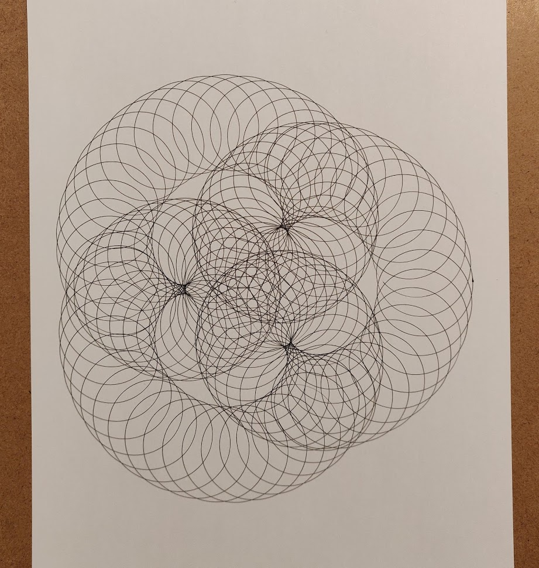</a>
<a href="examples/002">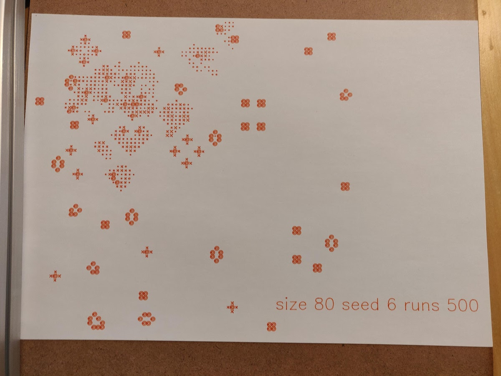</a>
<a href="examples/003"></a>
<a href="examples/004">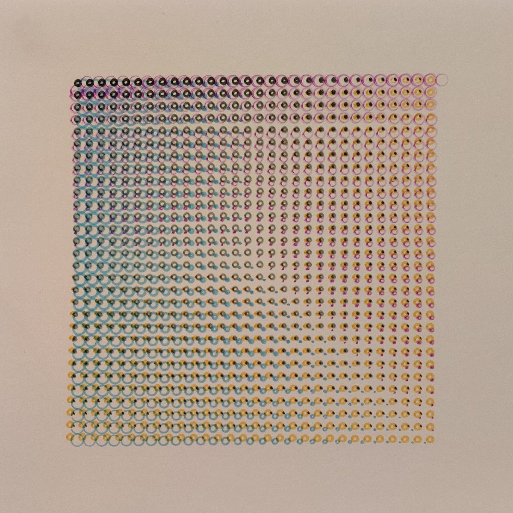</a>
<a href="examples/005"></a>
<a href="examples/006">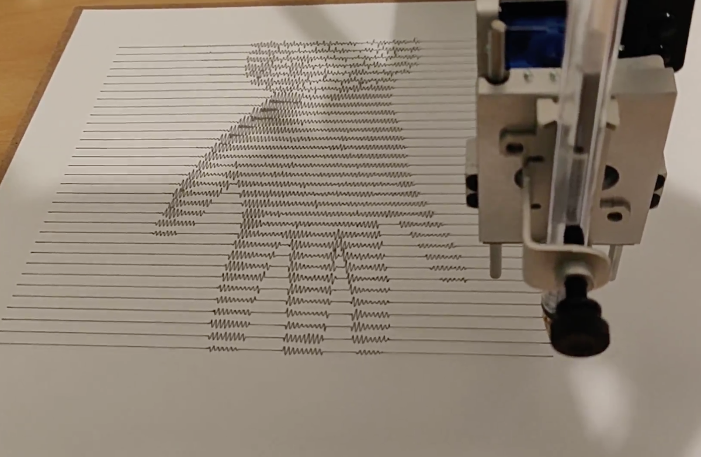</a>
<a href="examples/007">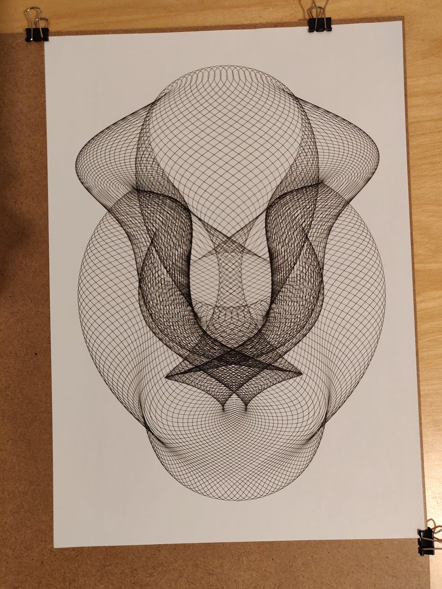</a>
<a href="examples/008">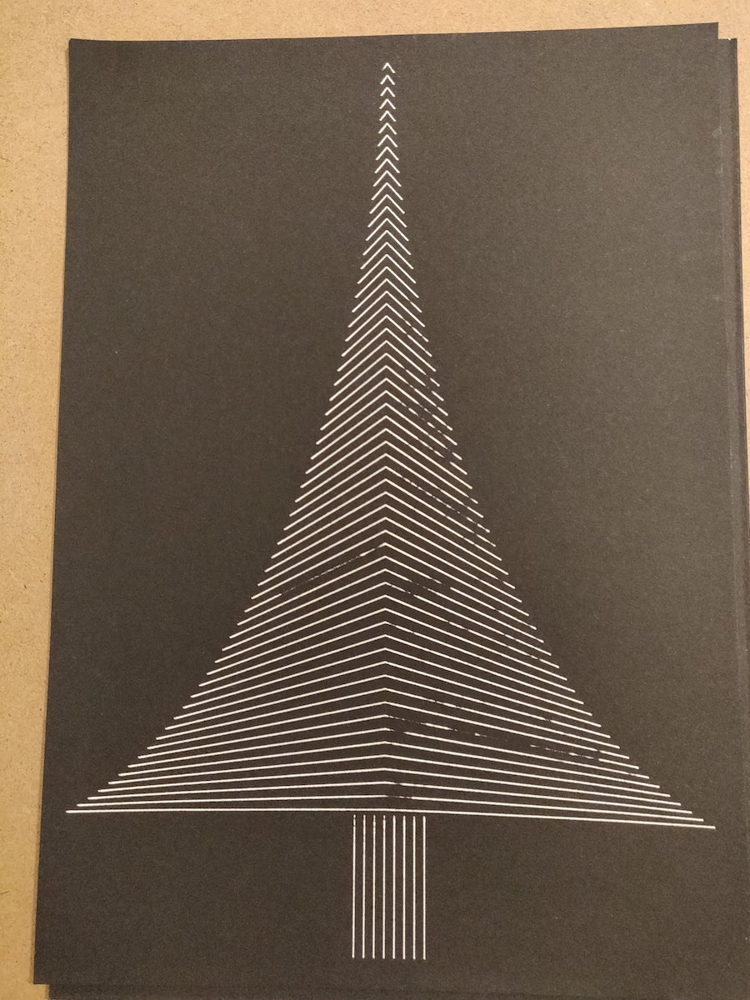</a>
<a href="examples/009">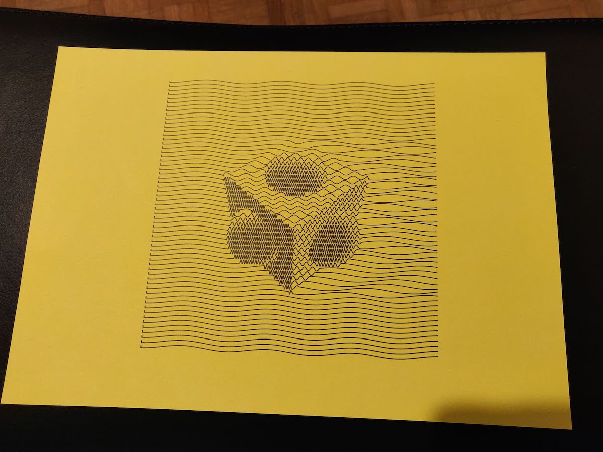</a>
<a href="examples/010">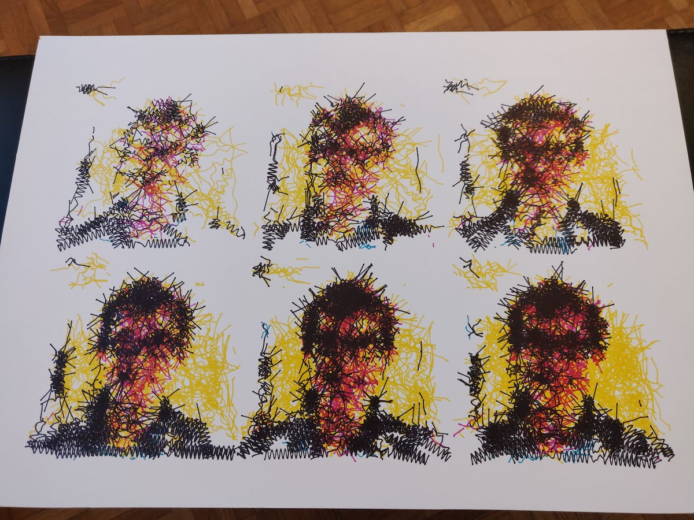</a>
<a href="examples/011">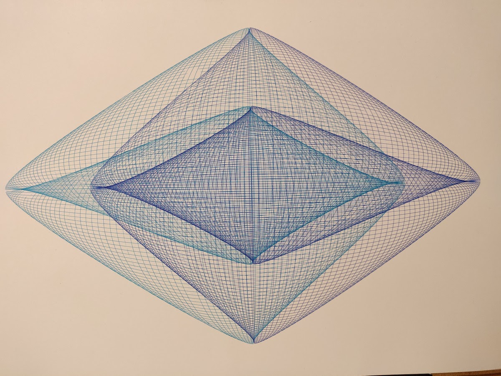</a>
<a href="examples/012">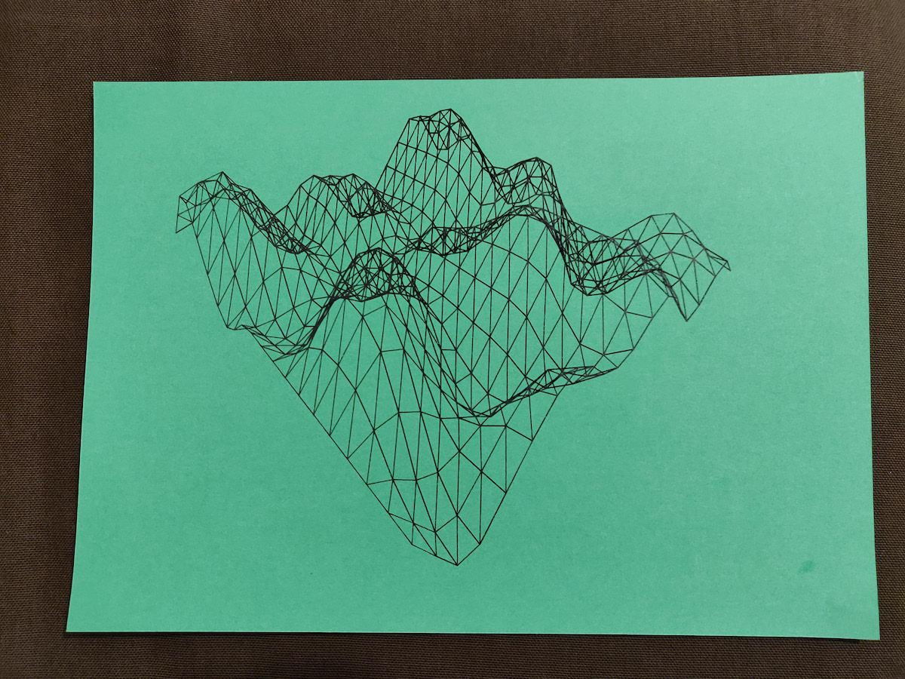</a>
<a href="examples/013">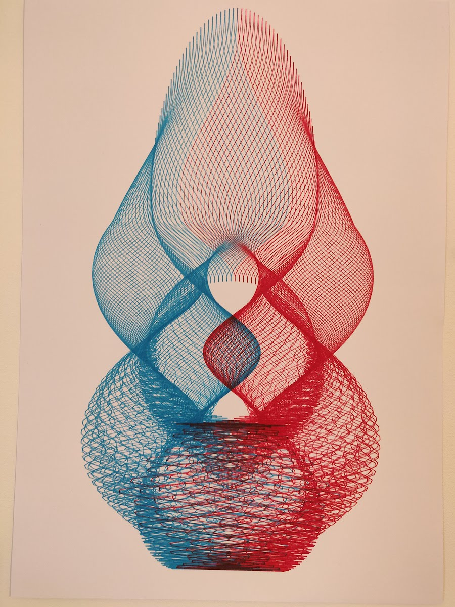</a>

---

(replace 000 with day number)

```
cargo run --example 000
```

How to do "hot reload":

Run this

```
cargo watch "run --example 000"
```

And then open the `image.svg` with a viewer that allows to update when the file changes. (E.g. vscode SVG Viewer)
